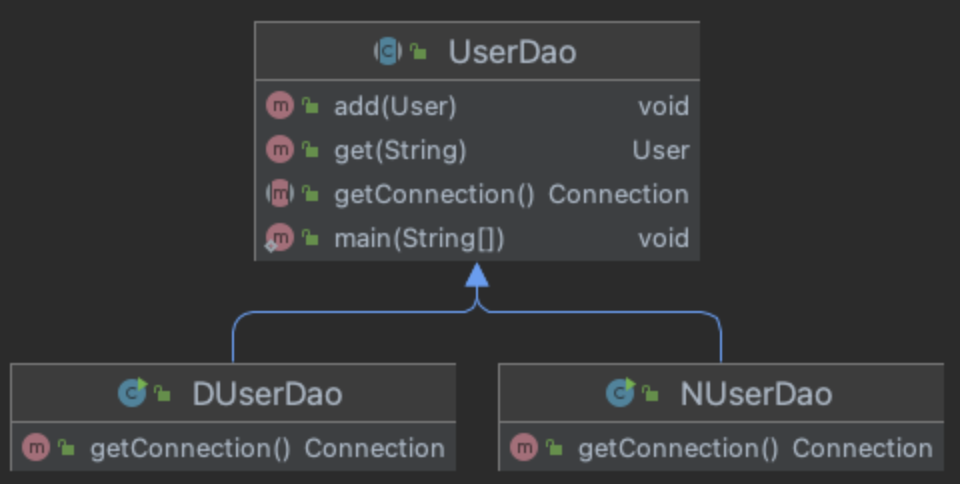

# Chapter 1. 오브젝트와 의존관계

- 스프링은 자바를 기반으로 한 기술
- 스프링이 자바에서 가장 중요하게 가치를 두는 것은 객체지향 언어라는 점이다.
- 객체지향 기본으로 돌아가자는 것이 스프링의 핵심 철학
- 스프링을 이해하려면 오브젝트에 깊은 관심을 가져야 한다.
    - 이는 오브젝트의 설계로 이어진다.
- 스프링은 객체지향 설계와 구현에 관해 특정한 모델과 기법을 강요하지 않지만 오브젝트를 어떻게 효과적으로 설계할지 명쾌한 기준을 마련해준다.

# 1.1. 초난감 DAO

---

- 사용자 정보를 JDBC API 를 통해 DB에 저장하고 조회할 수 있는 DAO 만들어보기

> DAO(Data Access Object): DB를 사용해 데이터를 조회/조작하는 기능을 전담하도록 만든 오브젝트
> 

## 1.1.1 User

---

- 사용자 정보를 저장할 객체, 자바빈 규약을 따르는 오브젝트
    
    ```java
    public class User {
        String id;
        String name;
        String password;
    
        public String getId() {
            return id;
        }
        public void setId(String id) {
            this.id = id;
        }
        public String getName() {
            return name;
        }
        public void setName(String name) {
            this.name = name;
        }
        public String getPassword() {
            return password;
        }
        public void setPassword(String password) {
            this.password = password;
        }
    }
    ```
    
    > 자바빈(JavaBean): 간단히 빈이라고 부르기도 한다.
    > 
    > - 디폴트 생성자: 자바빈은 파라미터가 없는 디폴트 생성자를 갖고 있어야 한다. 툴이나 프레임워크에서 리플렉션을 이용해 오브젝트를 생성하기 때문에 필요하다.
    > - 프로퍼티: 자바빈이 노출하는 이름을 가진 속성을 프로퍼티라고 한다.
    

## 1.1.2 UserDao

---

- 사용자 정보를 DB에 넣고 관리할 수 있는 DAO 클래스
    - 일단 새로운 사용자를 생성하고, 아이디를 가지고 사용자 정보를 읽어오는 메소드를 만듬
    
- JDBC를 이용하는 작업의 일반적인 순서
    1. DB 연결을 위한 `Connection`을 가져온다.
    2. SQL을 담은 `Statement`(또는 `PreparedStatement`)를 만든다.
    3. 만들어진 `Statement`를 실행한다.
    4. 조회 SQL 실행 결과를 `ResultSet`으로 받아서 정보를 저장할 오브젝트에 옮겨준다.
    5. 작업 중 생성된 Connection, Statement, ResultSet 같은 리소스는 반드시 닫아준다.
    6. JDBC API가 만들어내는 예외를 직접 처리하거나, `throws`로 던지게 한다.
    
    ```java
    public class UserDao {
        public void add(User user) throws ClassNotFoundException, SQLException {
            Class.forName("com.mysql.jdbc.Driver");
            Connection conn = DriverManager.getConnection(
                            "jdbc:mysql://localhost/springbook", "spring", "book");
    
            PreparedStatement ps = conn.prepareStatement(
                "insert into users(id, name, password) values (?,?,?)");
            ps.setString(1, user.getId());
            ps.setString(2, user.getName());
            ps.setString(3, user.getPassword());
    
            ps.executeUpdate();
    
            ps.close();
            conn.close();
        }
    
        public User get(String id) throws ClassNotFoundException, SQLException {
            Class.forName("com.mysql.jdbc.Driver");
            Connection conn = DriverManager.getConnection(
                            "jdbc:mysql://localhost/springbook", "spring", "book");
    
            PreparedStatement ps = conn.prepareStatement(
                         "select * from users where id = ?");
            ps.setString(1, id);
    
            ResultSet rs = ps.executeQuery();
            rs.next();
            User user = new User();
            user.setId(rs.getString("id"));
            user.setName(rs.getString("name"));
            user.setPassword(rs.getString("password"));
    
            rs.close();
            ps.close();
            conn.close();
    
            return user;
        }
    }
    ```
    

## 1.1.3 `main()`을 이용한 DAO 테스트 코드

---

- 코드의 기능을 검증하고자 할 때 가장 간단한 방법은 오브젝트 스스로 자신을 검증하도록 만들어주는 것
- 셀프 테스트용 `main` 메소드
    
    ```java
    public static void main(String[]args)throws SQLException,ClassNotFoundException{
        UserDao dao = new UserDao();
    
        User user = new User();
        user.setId("jenny");
        user.setName("김윤희");
        user.setPassword("password");
    
        dao.add(user);
    
        System.out.println(user.getId() + " 등록 성공");
    
        User user2 = dao.get(user.getId());
        System.out.println(user2.getName());
        System.out.println(user2.getPassword());
    }
    ```
    

# 1.2 DAO의 분리

---

## 1.2.1 관심사의 분리

---

- 객체지향의 세계에서는 모든 것이 변한다.
    - 변수나 오브젝트 필드 값이 아닌, 오브젝트에 대한 설계와 구현한 코드가 변한다는 뜻
- 사용자의 비즈니스 프로세스와 요구사항은 끊임없이 바뀌고 발전한다.
- 개발자가 객체를 설계할 때 가장 염두할 사항은 미래의 변화를 어떻게 대비할 것인가이다.
    - 변화의 폭을 최소한으로 줄여주는 것
- 모든 변경과 발전은 한 번에 한 가지 관심사항에 집중해서 일어난다.
    - 문제는, 그에 따른 작업은 한 곳에 집중되지 않는 경우가 많다.
- 우리가 준비해야 할 일은 한 가지 관심이 한 군데에 집중되게 하는 것이다.
    - 프로그래밍 기초 개념 중 관심사의 분리(Separation of Concerns)

## 1.2.2 커넥션 만들기의 추출

---

### UserDao의 관심사항

---

1. DB 연결을 위한 커넥션 가져오기
2. 사용자 등록을 위해 DB에 보낼 SQL을 만들고 실행하기
3. 작업이 끝나면 리소스(`Statement`, `Connection`) 닫기

### 중복 코드의 메소드 추출

---

- 커넥션을 가져오는 중복된 코드를 분리
    - getConnection()

```java
public void add(User user) throws ClassNotFoundException, SQLException {
    Connection conn = getConnection();
    ...
}

public User get(String id) throws ClassNotFoundException, SQLException {
    Connection conn = getConnection();
    ...
}

private Connection getConnection() throws ClassNotFoundException, SQLException {
    Class.forName("com.mysql.jdbc.Driver");
    return DriverManager.getConnection(
        "jdbc:mysql://localhost/springbook", "spring", "book");
}
```

### 변경사항에 대한 검증: 리팩토링과 테스트

---

- 이런 작업을 리팩토링(Refactoring)이라고 한다.
    - 메소드 추출 기법: 공통의 기능을 담당하는 메소드로 중복된 코드를 뽑아내는 것

> 리팩토링: 기존의 코드를 외부의 동작방식 변화 없이 내부 구조를 변경해서 재구성하는 작업
> 
> - 코드 내부 설계가 개선되어 코드를 이해하기가 더 편해지고, 변화에 효율적으로 대응할 수 있다.
> - 리팩토링이 필요한 코드의 특징을 나쁜 냄새라고 부르기도 한다.

## 1.2.3 DB 커넥션 만들기의 독립

---

- UserDao가 인기를 끌더니 N 사와 D 사에서 구매하겠다는 주문이 들어왔다고 상상해보자.
    - 그런데 납품 과정에서 문제가 발생했다.
    - DB 커넥션을 가져오는 데 있어 독립적으로 만든 방법을 적용하고 싶어한다.
    - UserDao를 구매한 이후에도 DB 커넥션을 가져오는 방법이 종종 변경될 가능성이 있다.

### 상속을 통한 확장

---



1-1. 상속을 통한 UserDao 확장 방법

```java
public abstract class UserDao {
    ...
    public abstract Connection getConnection() throws ClassNotFoundException, SQLException;
}

public class NUserDao extends UserDao {
    @Override
    public Connection getConnection() throws ClassNotFoundException, SQLException {
        // N 사 DB connection 생성코드
    }
}

public class DUserDao extends UserDao {
    @Override
    public Connection getConnection() throws ClassNotFoundException, SQLException {
        // D 사 DB connection 생성코드
    }
}
```

- UserDao: DAO 의 핵심 기능인 어떻게 데이터를 등록하고 가져올 것인가라는 관심을 담당
- NUserDao, DUserDao: DB 연결 방법은 어떻게 할 것인가라는 관심
- 클래스 계층구조를 통해 두 개의 관심이 독립적으로 분리되면서 변경 작업은 한층 용이해졌다.

- 템플릿 메소드 패턴(Template Method Pattern)
    - 변하지 않는 기능은 슈퍼클래스에 만들어두고 자주 변경되며 확장할 기능은 서브클래스에서 만들도록 한다.
        - 슈퍼클래스에서는 미리 추상 메소드 또는 오버라이드 가능한 메소드를 정의해두고 이를 활용해 코드의 기본 알고리즘을 담고 있는 템플릿 메소드를 만든다.
    - 훅 메소드: 슈퍼클래스에서 디폴트 기능을 정의해두거나 비워뒀다가 서브클래스에서 선택적으로 오버라이드할 수 있도록 만들어둔 메소드
- 팩토리 메소드 패턴 (Factory Method Pattern)
    - 이 메소드는 주로 인터페이스 타입으로 오브젝트를 리턴하므로 서브클래스에서 정확히 어떤 클래스의 오브젝트를 만들어 리턴할지는 슈퍼클래스에서는 알지 못한다.
        - 서브클래스는 다양한 방법으로 오브젝트를 생성하는 메소드를 재정의할 수 있다.
    - 팩토리 메소드: 서브클래스에서 오브젝트 생성 방법과 클래스를 결정할 수 있도록 미리 정의해둔 메소드. 자바에서는 오브젝트를 생성하는 기능을 가진 메소드를 팩토리 메소드라고 부르기도 한다. 의미가 다르므로 혼동하지 않도록 주의해야 한다.
    - 팩토리 메소드 패턴: 위 방식을 통해 오브젝트 생성 방법을 나머지 로직, 즉 슈퍼클래스의 기본 코드에서 독립시키는 방법

→ 이 방법은 상속을 사용했다는 단점이 있다.

- 상속 자체는 편리하게 느껴지지만 많은 한계점이 존재한다.
    - 자바는 클래스의 다중상속을 허용하지 않는다.
    - 상속을 통한 상하위 클래스 간의 관계는 밀접하다.

# 1.3 DAO의 확장

---

- 지금까지 데이터 엑세스 로직을 어떻게 만들 것인가와 DB 연결을 어떤 방법으로 할 것인가 라는 두 개의 관심을 상하위 클래스로 분리시켰다.

→ 이 두 개의 관심은 변화의 성격이 다르다.

- 변화의 이유와 시기, 주기 등이 다르다는 뜻
- 변화의 성격이 다른 것을 분리해서, 서로 영향을 주지 않은 채로 각각 독립적으로 변경할 수 있게 되었지만, 상속을 사용했다는 사실이 불편하다.

## 1.3.1 클래스의 분리

---

- 관심사가 다르고 변화의 성격이 다른 두 코드를 좀 더 분리해보자.
    
    ```java
    public class UserDao {
        private SimpleConnectionMaker simpleConnectionMaker;
    
        public UserDao() {
            simpleConnectionMaker = new SimpleConnectionMaker();
        }
    
        public void add(User user) throws ClassNotFoundException, SQLException {
            Connection conn = simpleConnectionMaker.makeNewConnection();
            ...
        }
    
        public User get(String id) throws ClassNotFoundException, SQLException {
            Connection conn = simpleConnectionMaker.makeNewConnection();
            ...
        }
    }
    ```
    
- DB 커넥션 생성 기능을 독립시킨 SimpleConnectionMaker
    
    ```java
    public class SimpleConnectionMaker {
        public Connection makeNewConnection() throws ClassNotFoundException, SQLException {
            Class.forName("com.mysql.jdbc.Driver");
            return DriverManager.getConnection(
                "jdbc:mysql://localhost/springbook", "spring", "book");
    }
    ```
    
- 하지만 N 사와 D 사에 UserDao 클래스만 공급하고 상속을 통해 DB 커넥션 기능을 확장해서 사용하게 했던 게 다시 불가능해졌다.
    - UserDao의 코드가 SimpleConnectionMaker 클래스에 종속되어 있기 때문에 DB 커넥션 생성 기능을 변경할 방법이 없다.

## 1.3.2 인터페이스의 도입

---

- 클래스를 분리하면서도 확장 문제를 해결할 수는 없을까?
- 두 개의 클래스가 긴밀하게 연결되어 있지 않도록 중간에 추상적인 느슨한 연결고리를 만들어주는 것 → 인터페이스의 도입
    - 이제 UserDao는 자신이 사용할 클래스가 어떤 것인지 몰라도 된다. 단지 인터페이스(ConnectionMaker)를 통해 원하는 기능을 사용하기만 하면 된다.
    
    
    
    1-4. 인터페이스를 도입한 결과
    
    ```java
    public interface ConnectionMaker {
        Connection makeConnection() throws ClassNotFoundException, SQLException;
    }
    ```
    
    ```java
    public class NConnectionMaker implements ConnectionMaker {
        @Override
        public Connection makeConnection() throws ClassNotFoundException, SQLException {
            // N 사의 커넥션 생성 코드
        }
    }
    
    public class DConnectionMaker implements ConnectionMaker {
        @Override
        public Connection makeConnection() throws ClassNotFoundException, SQLException {
            // D 사의 커넥션 생성 코드
        }
    }
    ```
    
    ```java
    public class UserDao {
        private ConnectionMaker connectionMaker;
    
        public UserDao() {
            this.connectionMaker = new NConnectionMaker();
        }
    
        public void add(User user) throws ClassNotFoundException, SQLException {
            Connection conn = connectionMaker.makeConnection();
            ...
        }
    
        public User get(String id) throws ClassNotFoundException, SQLException {
            Connection conn = connectionMaker.makeConnection();
            ...
        }
    }
    ```
    

## 1.3.3 관계설정 책임의 분리

---

- 여전히 UserDao에는 어떤 ConnectionMaker 구현 클래스를 사용할지를 결정하는 코드가 남아 있다.
- UserDao 안에 분리되지 않은, 또 다른 관심사항이 존재
    - `new` 키워드 → UserDao와 ConnectionMaker 구현 클래스 사이의 관계를 설정해주는 것에 관한 관심
    
    → 이 관심사를 분리하지 않으면 UserDao는 독립적으로 확장 가능한 클래스가 될 수 없다.
    
- UserDao의 클라이언트 오브젝트에 관계를 결정해주는 기능을 분리해서 두자.
    
    ```java
    public class UserDao {
        private ConnectionMaker connectionMaker;
    
        public UserDao(ConnectionMaker connectionMaker) {
            this.connectionMaker = connectionMaker;
        }
        ...
    }
    ```
    
    - `new` 키워드가 사라졌다.
        - 이는 클래스 사이의 관계가 사라짐을 의미
    - ConnectionMaker 의존성을 갖고 있고, 이는 생성자를 통해 주입받는다.
        - 어떤 ConnectionMaker가 들어올지는 UserDao는 알지 못한다.
    - 이는 특정 클래스와 오브젝트와의 관계를 맺게 된 것이다. → 오브젝트 사이의 런타임 의존관계
    
    ```java
    public class UserDaoTest {
        public static void main(String[] args) throws SQLException, ClassNotFoundException {
            ConnectionMaker connectionMaker = new NConnectionMaker();
            UserDao dao = new UserDao(connectionMaker);
            ...
        }
    }
    ```
    
    → UserDao는 자신의 관심사이자 책임인 사용자 데이터 액세스 작업을 위해 SQL을 생성하고, 이를 실행하는 데만 집중할 수 있게 됐다.
    

## 1.3.4 원칙과 패턴

---

### 개방 폐쇄 원칙

---

- 개방 폐쇄 원칙(Open-Closed Principle)은 깔끔한 설계를 위해 적용 가능한 객체지향 설계 원칙 중의 하나이다.
- 클래스나 모듈은 확장에는 열려 있어야 하고 변경에는 닫혀 있어야 한다.
- UserDao는 DB 연결 방법이라는 기능을 확장하는 데는 열려 있고, 자신의 핵심 기능은 변화에 영향을 받지 않으므로 변경에는 닫혀 있다고 말할 수 있다.

### 높은 응집도와 낮은 결합도

---

- 개방 폐쇄 원칙은 높은 응집도와 낮은 결합도라는 소프트웨어 개발 고전적인 원리로도 설명이 가능하다.

- 응집도가 높다 → 하나의 책임 또는 관심사에 집중되어 있다라는 의미
    - 변화가 일어날 때 해당 모듈에서 변하는 부분이 크다.
    - 작업은 항상 전체적으로 일어나고, 무엇을 변경할지 명확하다.
    - 낮은 응집도를 가지고 있어, 만약 모듈의 일부분에서만 변경이 일어난다면, 해당 변경으로 인해 전체에 영향은 없는지 ? 확인하고 검증을 해야한다.
    - 하나의 공통 관심사는 한 클래스에 모여 있다.
    - 높은 응집도는 클래스 레벨 뿐 아니라, 패키지/컴포넌트/모듈에 이르기 까지 동일한 원리로 적용될 수 있다.
- 낮은 결합도
    - 결합도 → 하나의 오브젝트가 변경되었을때 그 변화가 다른 오브젝트에 변화를 요구하는 정도
    - 책임과 관심사가 다른 오브젝트와 느슨한 결합을 유지하는 것이 바람직 하다.
    - 느슨한 결합은 관계를 유지하는데 반드시 필요한 최소한의 방법으로 제공되어야 한다.
    - 낮은 결합도를 유지하면 변화에 대응하는 속도가 빨라지고 깔끔한 설계, 확장시 용이하다.
    - UserDao 를 보면 높은 응집도를 가지고 있고, ConnectionMaker 와의 낮은 결합도를 형성하고 있기 때문에 UserDao 를 변경하거나, ConnectionMaker 를 확장하더라도 서로 영향을 주지 않는다.

### 전략 패턴

---

- UserDaoTest - UserDao - ConnectionMaker 구조를 디자인 패턴의 시각으로 보면 전략 패턴(Strategy Pattern)에 해당한다.
- 전략 패턴은 디자인 패턴의 꽃 → 개방 폐쇄의 원칙 실현에도 가장 잘 들어맞는 패턴
- 전략 패턴의 구성요소 세가지
    - 전략을 가진 전략 객체 (ConnectionMaker)
    - 전략 객체를 사용하는 컨텍스트 (UserDao)
    - 전략 객체를 생성해 컨텍스트에 주입하는 클라이언트 (UserDaoTest)

# 1.4 제어의 역전(IoC)

---

- 제어의 역전(Inversion Of Control): IoC 라는 약자로 많이 사용되고, 스프링을 통해 많이 알려진 용어이다.

## 1.4.1 오브젝트 팩토리

---

- UserDaoTest는 UserDao의 기능이 잘 동작하는지를 테스트하려고 만든 것
- 하지만 UserDao가 어떤 ConnectionMaker를 사용할지 결정하는 역할까지 책임지고 있다.
    
    → 관심사의 분리 필요
    

### 팩토리

---

- 객체의 생성 방법을 결정하고, 생성된 오브젝트를 돌려주는 역할을 수행하는 객체를 팩토리(Factory)라고 한다.
- 오브젝트의 생성과 생성된 오브젝트를 사용하는 쪽의 역할 및 책임을 깔끔하게 분리하는 목적으로 사용한다.

### 설계도로서의 팩토리

---

- DaoFactory를 분리했을 때 얻을 수 있는 장점
    - 애플리케이션의 컴포넌트 역할을 하는 오브젝트와 애플리케이션의 구조를 결정하는 오브젝트를 분리했다.

## 1.4.2 오브젝트 팩토리의 활용

---

```java
public class DaoFactory {
    public UserDao userDao() {
        ConnectionMaker connectionMaker = connectionMaker();
        return new UserDao(connectionMaker);
    }

    public AccountDao accountDao() {
        ConnectionMaker connectionMaker = connectionMaker();
        return new AccountDao(connectionMaker);
    }

    public MessageDao messageDao() {
        ConnectionMaker connectionMaker = connectionMaker();
        return new MessageDao(connectionMaker);
    }

    private ConnectionMaker connectionMaker() {
        return new SimpleConnectionMaker();
    }
}
```

## 1.4.3 제어권의 이전을 통한 제어관계 역전

---

- UserDao와 DaoFactory에도 제어의 역전이 적용되어 있다.
- ConnectionMaker의 구현 클래스를 결정하고 오브젝트를 만드는 제어권은 UserDao에게 있었다. 그런데 지금은 DaoFactory에게 있다.
    
    → 스프링 없이도 IoC 개념을 이미 적용한 셈이다.
    
- IoC는 프레임워크만의 기술도 아니고 프레임워크가 꼭 필요한 개념도 아닌 상당히 폭넓게 사용되는 프로그래밍 모델이다.

# 1.5 스프링의 IoC

---

## 1.5.1 오브젝트 팩토리를 이용한 스프링 IoC

---

### 애플리케이션 컨텍스트와 설정정보

---

- 빈(bean): 스프링이 제어권을 가지고 직접 만들고 관계를 부여하는 오브젝트
    - 스프링 빈은 스프링 컨테이너가 생성과 관계설정, 사용 등을 제어해주는 제어의 역전이 적용된 오브젝트
- 빈 팩토리(bean factory): 빈의 생성과 관계설정 같은 제어를 담당하는 IoC 오브젝트
    - 이 좀 더 확장한 애플리케이션 컨텍스트(application context)를 주로 사용한다.

### DaoFactory를 사용하는 애플리케이션 컨텍스트

---

- `@Configuration`: 빈 팩토리를 위한 오브젝트 설정을 담당하는 클래스라고 인식
- `@Bean`: 오브젝트를 만들어주는 메소드

```java
@Configuration
public class DaoFactory {
    @Bean
    public UserDao userDao() {
        ConnectionMaker connectionMaker = connectionMaker();
        return new UserDao(connectionMaker);
    }

    @Bean
    public ConnectionMaker connectionMaker() {
        return new SimpleConnectionMaker();
    }
}
```

- `ApplicationContext`를 구현한 클래스는 여러가지가 있는데 `@Configuration`이 붙은 자바 코드를 설정정보로 사용하려면 `AnnotationConfigApplicationContext`를 이용하면 된다.
- `getBean()` 메소드를 이용해 `ApplicationContext`에 등록된 UserDao 오브젝트를 가져올 수 있다.
    - `AnnotationConfigApplicationContext`를 사용한다면, `AbstractApplicationContext`의 `getBean()` 메소드를 사용하게 된다.

```java
public class UserDaoTest {
    public static void main(String[] args) throws SQLException, ClassNotFoundException {
        ApplicationContext context =
            new AnnotationConfigApplicationContext(DaoFactory.class);
        UserDao dao = context.getBean("userDao", UserDao.class);
        ...
    }
}
```

## 1.5.2 애플리케이션 컨텍스트의 동작방식

---

- 애플리케이션 컨텍스트는 일종의 빈 팩토리
- 애플리케이션 컨텍스트를 사용했을 때 얻을 수 있는 장점
    1. 클라이언트는 구체적인 팩토리 클래스를 알 필요가 없다.
    2. 애플리케이션 컨텍스트는 종합 IoC 서비스를 제공해준다.
    3. 애플리케이션 컨텍스트는 빈을 검색하는 다양한 방법을 제공한다.****

# 1.6 싱글톤 레지스트리와 오브젝트 스코프

---

- 기존에 직접 만들었던 오브젝트 팩토리(DaoFactory)와 `ApplicationContext`는 중요한 차이점이 있다.
    - 스프링은 여러 번에 걸쳐 빈을 요청하더라도 매번 동일한 오브젝트를 돌려준다.

## 1.6.1 싱글톤 레지스트리로서의 애플리케이션 컨텍스트

---

- 애플리케이션 컨텍스트는 오브젝트 팩토리와 비슷한 방식으로 동작하는 IoC 컨테이너다.
- 동시에 싱글톤을 저장하고 관리하는 싱글톤 레지스트리(Singleton Registry)이기도 하다.
- 스프링은 기본적으로 내부에서 생성하는 빈을 싱글톤으로 관리한다.

### 서버 애플리케이션과 싱글톤

---

- 스프링이 빈을 기본적으로 싱글톤으로 만드는 이유
    - 스프링을 주요 사용하는 환경은 자바 엔터프라이즈 기술을 사용하는 서버 환경 이기 때문이다.
    - 매번 클라이언트에서 요청이 올때마다 비즈니스를 담당하는 오브젝트를 새롭게 만든다고 생각해보면 트래픽이 치솟았을때 서버의 부하도 만만치 않게 된다.
- 엔터프라이즈 분야에서는 서비스 오브젝트 라는 개념을 적용해 왔다.
    - 서블릿이 대표적인 서비스 오브젝트
    - 대부분 멀티스레드 환경에서 싱글톤으로 동작한다.
- 디자인패턴에서 소개되는 싱글톤은 제한되는 부분과 여러가지 문제점들이 존재하기 때문에 안티패턴이라고 불리기도 한다.

### 싱글톤 패턴의 한계

---

- 자바에서 싱글톤을 구현하는 방법
    1. `private` 생성자
    2. 싱글톤 객체를 저장할 스태틱 필드 정의
    3. 스태틱 팩토리 메소드를 정의하고, 해당 메소드가 최초 호출되는 시점에 단 한번만 오브젝트가 생성되도록 한다.
    4. 최초 오브젝트 생성된 이후 요청은 기존에 생성해두었던 오브젝트를 재사용한다.
    
    ```java
    class UserDao {
       
        private static UserDao INSTANCE;
        ...
        
        private UserDao(ConnectionMaker connectionMaker) {
            this.connectionMaker = connectionMaker;
        }
        
        public static synchronized UserDao getInstance() {
            if (INSTANCE == null) INSTANCE = new UserDao(???);
            return INSTANCE;
        }
    }
    ```
    
- 싱글톤 패턴 구현방식 문제
    - `private` 생성자를 갖고 있기 때문에 상속할 수 없다.
    - 싱글톤은 테스트하기가 힘들다.
    - 서버환경에서는 싱글톤이 하나만 만들어지는 것을 보장하지 못한다.
    - 싱글톤의 사용은 전역 상태를 만들 수 있기 때문에 바람직하지 못하다.

### 싱글톤 레지스트리

---

- 싱글톤 레지스트리: 스프링은 직접 싱글톤 형태의 오브젝트를 만들고 관리하는 기능을 제공한다.

## 1.6.2 싱글톤과 오브젝트의 상태

---

- 싱글톤이 멀티스레드 환경에서 서비스 형태의 오브젝트로 사용되는 경우, 상태정보를 내부에 갖고 있지 않은 무상태 방식으로 만들어져야 한다.
    - 스레드들이 동시에 싱글톤 오브젝트의 인스턴스 변수를 수정하는 것은 매우 위험하다.
- 메소드 파라미터나, 메소드 안에서 생성되는 로컬 변수는 매번 새로운 값을 저장할 독립적인 공간이 만들어지기 때문에 싱글톤이라고 해도 여러 스레드가 변수의 값을 덮어쓸 일은 없다.
- 단순한 읽기전용 값이라면 `static final`이나 `final`로 선언하는 편이 낫다.

## 1.6.3 스프링 빈의 스코프

---

- 빈의 스코프: 빈이 생성되고, 존재하고, 적용되는 범위
    - 기본 스코프는 싱글톤
    - 프로토타입 스코프: 컨테이너에 빈을 요청할 때마다 매번 새로운 오브젝트를 만들어준다.
    - 요청 스코프: 새로운 HTTP 요청이 생길 때마다 생성됨
    - 세션 스코프: 웹의 세션과 스코프가 유사

# 1.7 의존관계 주입(DI)

---

## 1.7.1 제어의 역전(IoC)과 의존관계 주입

---

- 스프링 IoC 기능의 대표적인 동작 원리는 의존성 주입이라고 불린다.
    - 이를 DI(Dependency Injection)이라고 한다.
- DI는 오브젝트 레퍼런스를 외부로부터 제공 받아 이를 통해 다른 오브젝트와의 관계가 다이나믹하게 형성되는 것이 핵심이다.

## 1.7.2 런타임 의존관계 설정

---

### 의존관계

---

- 의존관계는 A 가 B 에 의존하고 있을경우 점선으로 표기하는 것이 핵심이다.
- B 가 변경됬을때, A 가 변경될 수도 있다.
- 변경 될 가능성이 있음을 얘기하는 것이 의존관계
    
    
    

### UserDao의 의존관계

---


1-11. 인터페이스를 통한 느슨한 결합을 갖는 의존관계

- UserDao 는 ConnectionMaker 인터페이스에 의존 한다.
- 인터페이스가 변경되면 영향을 받지만, 해당 구현체 (DConnectionMaker/NConnectionMaker)가 변경되었을때는 영향을 받지 않는다.
- 인터페이스에 대해 의존관계를 형성하면 느슨한 관계가 형성되고, 결합도가 낮다고 할 수 있다.

- 의존관계 주입: 다음 세 가지 조건을 충족하는 작업
    - 클래스 모델이나 코드에는 런타임 시점의 의존관계가 드러나지 않는다.
        - 인터페이스나 추상클래스에 의존해야한다.
    - 런타임 시점의 의존관계는 컨테이너 또는 팩토리와 같은 제3의 존재가 결정한다.
    - 의존관계는 사용할 오브젝트에 대한 레퍼런스를 외부에서 제공(주입)해줌으로써 만들어진다.

## 1.7.3 의존관계 검색과 주입

---

- 스프링이 제공하는 IoC 방법은 의존관계 주입과 의존관계 검색이 있다.
- 런타임시 의존관계를 결정하는 점에서 의존관계 주입과 비슷하지만, 의존관계를 맺는 방법이 외부로 부터 주입이 아닌 스스로 검색을 하기 때문에 의존성 검색(dependency lookup) 이라고 한다.
    
    ```java
    class UserDao {
        public UserDao() {
            ApplicationContext context =
                new AnnotationConfigApplicationContext(DaoFactory.class);
            this.connectionMaker = context.getBean("connectionMaker", ConnectionMaker.class);
        }
    }
    ```
    
    - 스프링이 제공하는 의존관계 주입과의 큰 차이는, 의존관계 주입의 경우 주입 받을 대상도 스프링 빈 이어야한다.
        - 하지만 의존관계 검색의 경우 주입 받을 대상은 스프링 빈일 필요가 없다.
    
    → 대개는 의존관계 주입 방식을 사용하는 편이 낫다.
    
    - 코드 안에 오브젝트 팩토리나 스프링 API가 드러나기 때문이다.

## 1.7.4 의존관계 주입의 응용

---

### 기능 구현의 교환

---

### 부가기능 추가

---

책 내용 참고…

## 1.7.5 메소드를 이용한 의존관계 주입

---

- 수정자 메소드를 이용한 주입
- 일반 메소드를 이용한 주입
- 생성자 주입, 필드 주입 → 최근에는 생성자 주입 방식을 권장한다.
    - 스프링부트에서 `@Autowired`로 주입받아서 사용하다가는 아직 등록되지 않은 Bean을 사용한다는 에러를 만날 수 있다.
        - 패키지명 순서대로 스캔하여 Bean 을 등록하기 때문에 필드 주입시 해당 빈이 없을경우 Bean 생성 에러가 발생한다.
    - 생성자 주입 권장하는 이유
        1. 스프링에서 권장하는 의존성 주입 방식
        2. 의존성 객체의 생성을 보장한다.
        3. 순환 참조시 예외가 발생한다.
        4. 생성자 주입은 테스트코드 작성시 용이하다.
        5. 스프링 철학 중 하나 → 스프링 종속적인 애노테이션을 최대한 사용하지 않는 것 (스프링에 의존적인 부분을 최소화 하자)

- 참고
    - [https://github.com/Cr0ffle/Spring/blob/main/[01]_오브젝트와_의존관계/index.md](https://github.com/Cr0ffle/Spring/blob/main/%5B01%5D_%EC%98%A4%EB%B8%8C%EC%A0%9D%ED%8A%B8%EC%99%80_%EC%9D%98%EC%A1%B4%EA%B4%80%EA%B3%84/index.md)
