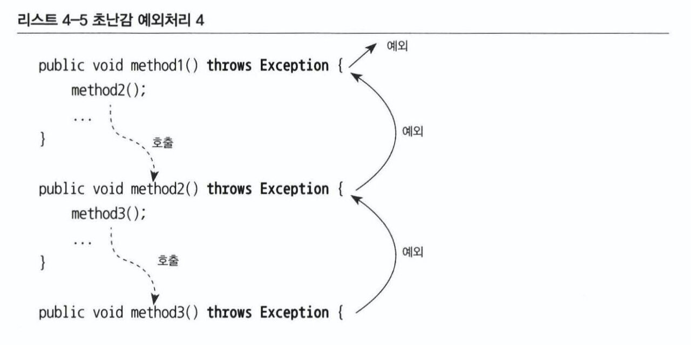

# Chapter 4. 예외

## 1. 사라진 SQLException

---

### 1-1. 초난감 예외처리

---

- 예외를 처리할 때 반드시 지켜야 할 핵심 원칙
    - 모든 예외는 적절하게 복구되든지 아니면 작업을 중단시키고 운영자 또는 개발자에게 분명하게 통보되야 한다.

- 1️⃣ 예외 블랙홀: 오류가 있어서 예외가 발생했는데, 그것을 무시하고 진행하게된다.
    
    ```java
    try {
    	...
    } catch (Exception e) {	//예외를 잡고 아무것도 하지 않는 것
    }
    ```
    
    → 예상치 못한 다른 문제를 일으킬 것이다.
    
    - 예외를 잡아서 조치를 취할 방법이 없다면 잡지 말아야 한다.
    - `throws Exception` 선언해서 메소드 밖으로 던지고 자신을 호출한 코드에 예외처리 책임을 전가하자.
- 2️⃣ 무의미하고 무책임한 `throws`
    
    
    
    - 메소드마다 `throws Exception`을 기계적으로 붙이는 개발자 → 직장인 개발자
    - 정말 실행 중 예외적인 상황이 발생할 수 있다는 건지, 습관적 복붙인지 알 수가 없다.
    
    → 적절한 처리를 통해 복구될 수 있는 예외상황도 제대로 다룰 수 있는 기회를 박탈당한다.
    

👉 이 두 가지 나쁜 습관은 어떤 경우에도 용납하지 않아야 한다.

### 1-2. 예외의 종류와 특징

---


1️⃣ Error: `java.lang.Error` 클래스의 서브 클래스들

- 애플리케이션에서는 이런 에러에 대한 처리는 신경쓰지 않아도 된다.
    - JVM에서 주로 발생시키는 `Error`의 서브 클래스이며, 시스템에 비정상적인 상황이 발생한 경우 사용된다.
    - 메모리, 스레드 등의 이슈는 어플리케이션 레벨에서 대응할 수 없으니 `catch`로 잡지 않는다.
    - ex> `VirtualMachineError`, `LinkageError`, `AssertionError`, `ThreadDeath` 등

2️⃣ `Exception`, 체크 예외: `java.lang.Exception` 상속한 클래스

- 반드시 `catch`를 잡든지, 다시 `throws`를 정의해서 던져야 한다. (아니면 컴파일 에러 발생)
    - ex> `IOException`, `SQLException`

3️⃣ `RuntimeException`, 언체크/런타임 예외: `java.lang.RuntimeException` 상속한 클래스

- 예외 처리를 강제하지 않는다.
    - `RuntimeException`: JVM 의 정상적인 작동 중에 발생할 수 있는 예외의 수퍼 클래스
- 피할 수 있지만 개발자의 부주의로 인해 발생할 수 있는 경우에 발생
    - ex> `NullPointerException`, `IllegalArgumentException`
- 트랜잭션이 롤백된다.
    - 레퍼런스: [https://docs.spring.io/spring-framework/docs/5.3.x/reference/html/data-access.html#transaction-declarative-attransactional-settings](https://docs.spring.io/spring-framework/docs/5.3.x/reference/html/data-access.html#transaction-declarative-attransactional-settings)
    - [참고](https://sup2is.github.io/2021/03/04/java-exceptions-and-spring-transactional.html)

👉 최근 새로 등장하는 자바 표준 스펙 API 들은 예상 가능한 예외상황을 다루는 예외를 체크 예외로 만들지 않는 경향이 있다.

- 자바 11의 `Throwable` 타입 계층 구조 중 `java.lang` 패키지에 소속된 것들
    - `*`: `unchecked exception`
    
    ```java
    Throwable (java.lang)
        Error (java.lang) *
            AnnotationFormatError (java.lang.annotation) *
            AssertionError (java.lang) *
            VirtualMachineError (java.lang) *
                StackOverflowError (java.lang) *
                UnknownError (java.lang) *
                InternalError (java.lang) *
                OutOfMemoryError (java.lang) *
            LinkageError (java.lang) *
                ClassCircularityError (java.lang) *
                IncompatibleClassChangeError (java.lang) *
                    NoSuchFieldError (java.lang) *
                    InstantiationError (java.lang) *
                    IllegalAccessError (java.lang) *
                    NoSuchMethodError (java.lang) *
                    AbstractMethodError (java.lang) *
                BootstrapMethodError (java.lang) *
                ClassFormatError (java.lang) *
                    GenericSignatureFormatError (java.lang.reflect) *
                    UnsupportedClassVersionError (java.lang) *
                UnsatisfiedLinkError (java.lang) *
                NoClassDefFoundError (java.lang) *
                ExceptionInInitializerError (java.lang) *
                VerifyError (java.lang) *
            ThreadDeath (java.lang) *
        Exception (java.lang)
            CloneNotSupportedException (java.lang)
            StringConcatException (java.lang.invoke)
            ReflectiveOperationException (java.lang)
                IllegalAccessException (java.lang)
                NoSuchFieldException (java.lang)
                NoSuchMethodException (java.lang)
                InstantiationException (java.lang)
                ClassNotFoundException (java.lang)
                InvocationTargetException (java.lang.reflect)
            LambdaConversionException (java.lang.invoke)
            IllegalClassFormatException (java.lang.instrument)
            UnmodifiableClassException (java.lang.instrument)
            RuntimeException (java.lang) *
                IndexOutOfBoundsException (java.lang) *
                ArithmeticException (java.lang) *
                LayerInstantiationException (java.lang) *
                ClassCastException (java.lang) *
                UnmodifiableModuleException (java.lang.instrument) *
                BytecodeGenerationException in InvokerBytecodeGenerator (java.lang.invoke) *
                SecurityException (java.lang) *
                InaccessibleObjectException (java.lang.reflect) *
                AnnotationTypeMismatchException (java.lang.annotation) *
                ArrayStoreException (java.lang) *
                EnumConstantNotPresentException (java.lang) *
                WrongMethodTypeException (java.lang.invoke) *
                IncompleteAnnotationException (java.lang.annotation) *
                MalformedParametersException (java.lang.reflect) *
                UndeclaredThrowableException (java.lang.reflect) *
                InvalidModuleDescriptorException (java.lang.module) *
                TypeNotPresentException (java.lang) *
                IllegalMonitorStateException (java.lang) *
                NegativeArraySizeException (java.lang) *
                UnsupportedOperationException (java.lang) *
                ResolutionException (java.lang.module) *
                IllegalStateException (java.lang) *
                NullPointerException (java.lang) *
                IllegalCallerException (java.lang) *
                FindException (java.lang.module) *
                MalformedParameterizedTypeException (java.lang.reflect) *
                IllegalArgumentException (java.lang) *
            InterruptedException (java.lang)
    ```
    

### 1-3. 예외처리 방법

---

- 1️⃣ 예외 복구: 예외 상황을 파악하고 문제를 해결해서 정상 상태로 돌려놓는 것
    
    ```java
    int maxretry = MAX_RETRY;
    **while (maxretry-- > 0)** {
    ****    try {
          ...     // 예외가 발생할 가능성이 있는 시도
          return; // 작업 성공
        } catch(SomeException e) { // 로그 출력. 정해진 시간만큼 대기, 체크 예외
        } finally {                // 리소스 반납. 정리 작업
        }
    }
    throw new RetryFailedException(); // 최대 재시도 횟수를 넘기면 직접 예외 발생, 언체크 예외
    ```
    
- 2️⃣ 예외처리 회피: 예외처리를 자신이 담당하지 않고, 자신을 호출한 쪽으로 던져버리는 것
    - `throws`로 선언해서 예외가 발생하면 알아서 던져지게 하기
        
        ```java
        public void add() **throws SQLException** {
            // JDBC API
        }
        ```
        
    - `catch`로 예외를 잡아 로그를 남긴 뒤 다시 예외를 던지기
        
        ```java
        public void add() **throws SQLException** {
            try {
                // JDBC API
            } catch (**SQLException e**) {
                //로그 출력
                **throw e**;
            }
        }
        ```
        
    - 다른 오브젝트에게 예외처리 책임을 분명히 지게 하거나, 자신을 사용하는 쪽에서 예외를 다루는 게 최선의 방법이라는 분명한 확신이 있어야 한다.
- 3️⃣ 예외 전환: 예외를 밖으로 던진다(예외 회피와 비슷), 그대로 넘기지 않고 적절한 예외로 전환해서 던진다.
    - 1️⃣ 로우레벨 예외의 의미를 분명하게 하기 위해 사용(추상화 된 예외로 전환)
        - 특정 기술의 정보를 해석하는 코드를 비지니스 로직을 담은 서비스 계층에 두는 건 매우 어색하다.
        
        ```java
        public void add(User user) throws **DuplicationUserIdException, SQLException** {
            try {
                // JDBC API
            } catch (SQLException e) {
                ****// MySQL 의 Duplicate Entry 이면 예외 전환
                **if (e.getErrorCode() == MySqlErrorNumbers.ER_DUP_ENTRY) {
                    throw new DuplicationUserIdException();**
                } else {
                    **throw e;** // 그 외는 SQLException 그대로
                }
                throw new RuntimeException(e);
            }
        }
        ```
        
    - 2️⃣ 예외 처리를 쉽고 단순하게 만들기 위해 포장
        - 주로 체크 예외를 언체크 예외인 런타임 예외로 바꾸는 경우 사용한다.
            - 비즈니스 로직으로 볼 때 의미있는 예외이거나 복구 가능한 예외가 아닐 경우, 런타임 예외로 포장해서 던진다.
            - 예시와 같이, 트랜잭션을 자동으로 롤백시킬때 유용하다.
                
                ```java
                try {
                    OrderHome orderHome = EJBHomeFactory.getInstance().getOrderHome();
                    Order order = orderHome.findByPrimaryKey(Integer id);
                } catch (**NamingException ne**) {
                    **throw new EJBException(ne);**
                } catch (**SQLException se**) {
                    **throw new EJBException(se);**
                } catch (**RemoteException re**) {
                    **throw new EJBException(re);**
                }
                ```
                
        - 불필요한 `throws`를 줄여준다.
            - 어차피 복구 불가능 예외라면 가능한 한 빨리 런타임 예외로 포장해 던져서, 다른 계층의 메소드를 작성할 때 불필요한 선언을 피하자.
    - 예외 전환 시, 원래 발생한 예외를 담아서 중첩 예외로 만드는 것이 좋다.
        
        ```java
        } catch (SQLException e) {
            **throw new DuplicationUserIdException(e);**
        		// or
            **throw new DuplicationUserIdException().initCause(e);**
        }
        ```
        

### 1-4. 예외처리 전략

---

- 런타임 예외의 보편화
    - Java 엔터프라이즈 서버 환경은 수 많은 사용자가 동시에 보낸 요청이 각각 독립적인 작업으로 취급된다.
        - 요청 처리 도중 예외가 발생하면 해당 작업만 중지하면 된다.
        - 독립형 어플리케이션과 달리 예외가 발생했을 때, 작업을 일시 중지하고 클라이언트와 커뮤니케이션하며 복구할 수 없기 때문이다.
    - 예외가 안 생기도록 하는 것이 가장 좋으며, 발생하면 빠르게 요청을 취소하고 개발자에게 통보하는 것이 좋다.
        - 체크 예외의 활용도가 점차 줄어들고 있으며, 복구 가능성이 조금이라도 있다면 체크 예외로 만든다고 생각했는데, 지금은 항상 복구할 수 있는 예외가 아니라면 일단 언체크 예외를 사용하는 추세다.
        - `CheckedException`은 무분별한 예외 전파의 원인이다
    - 단, 컴파일러가 예외 처리를 강제하지 않기 때문에 예외의 종류와 원인 및 활용 방안을 항상 문서화한다.
- 애플리케이션 예외
    - 런타임 예외 중심의 전략은 낙관적인 예외처리 기법이다.
        - 일단 복구할 수 있는 예외는 없다고 가정하고, 어차피 런타임 예외이므로 시스템 레벨에서 알아서 처리해줄 것이고, 꼭 필요한 경우는 런타임 예외라도 잡아서 복구/대응 가능하니 문제될 것이 없다는 태도
    - 1️⃣ 각각 다른 종류의 리턴 값을 돌려주는 것
        - 상수로 정의해둔 표준 코드를 사용하지 않는다면 휴먼 에러로 제대로 동작하지 않을 위험이 있다.
        - 결과 값을 확인하는 조건문이 자주 등장해, 지저분해지고 흐름 파악이 힘들어진다.
    - 2️⃣ 예외상황에서는 비즈니스 의미를 띤 예외를 던지도록 만드는 것
        - 의도적으로 체크 예외로 만들어, 잊지 않고 예외상황에 대한 로직을 구현하도록 강제할 수 있다.
            
            ```java
            try {
                BigDecimal balance = account.withdraw(amount);
                ...
                // 정상적인 처리 결과를 출력하도록 진행
            } catch(**InsufficientBalanceException e**) { // 체크 예외
                // InsufficientBalanceException에 담긴 인출 가능한 잔고금액 정보를 가져옴
                BigDecimal availFunds = e.getAvailFunds();
                ...
                // 잔고 부족 안내 메시지를 준비하고 이를 출력하도록 진행
            }
            ```
            

### 1-5. SQLException 은 어떻게 됐나?

---

- 시스템 예외는 어플리케이션 레벨에서 복구할 방법이 없다.
    - 개발자에게 빨리 예외가 발생했다는 사실이 알려지도록 전달하는 방법밖에는 없다.
    - 이를 통해, 입력 단계에서 검증을 강화하도록 개발자가 빠르게 조치를 취할 수 있다.
- `SQLException`을 다룰 수 있는 가능성은 거의 없다.
    - 필요없는 기계적인 `throws`선언이 등장하도록 방치하지 말고 가능한 빨리 언체크/런타임 예외로 전환해줘야 한다.
    - 스프링 `JdbcTemplate`, `JPA`는 런타임 예외인 `org.springframework.dao.DataAccessException`으로 포장해서 던져준다.

### 이펙티브 자바(3판) 10장. 예외

---

- 아이템 69. 예외는 진짜 예외 상황에만 사용하라
    - 예외는 반드시 예외 상황에서만 사용하며 일상적인 제어 흐름용으로 사용해서는 안 된다.
        - 잘 설계된 API라면 클라이언트가 정상적인 제어 흐름에서 예외를 사용할 일이 없어야 한다.
        
        ```java
        try {
            int i = 0;
            while(true)
                range[i++].climb();
        } catch (ArrayIndexOutOfBoundsException e) {
            // 예외를 사용하여 루프를 종료 -> 이렇게 작성하면 안 된다.
        }
        ```
        
    - 상태 검사 메서드를 제공하거나 옵셔널 또는 특정 값을 반환하도록 하면 된다.
    
    👉 예외는 예외 상황에서 사용될 의도로 설계되었다.
    
- 아이템 70. 복구할 수 있는 상황에는 검사 예외를, 프로그래밍 오류에는 런타임 예외를 사용하라
- 아이템 71. 필요 없는 검사 예외 사용은 피하라
    - API를 제대로 사용해도 발생할 수 있거나 개발자가 의미 있는 조치를 할 수 있다면 검사 예외를 사용하는 것이 좋다. 그렇지 않은 경우는 대부분 비검사 예외를 사용하는 게 좋다.
    - 검사 예외를 회피하는 방법
        - 적절한 결과 타입을 담은 옵셔널
            - 검사 예외를 던지는 대신에 빈 옵셔널을 반환해보자.
            - 단점이라면 예외가 발생한 이유를 알려주는 부가 정보를 담을 수 없다.
        - 검사 예외를 던지는 메서드를 쪼개본다.
            - 예외가 던져질지 여부를 `boolean`값을 반환하는 메서드를 통해 결정하는 것이다. 조건문이 생기긴 하지만 예외에 대해 조금 더 유연하게 대처할 수 있다.
                
                ```java
                // 변경 전
                try {
                    obj.action(args);
                } catch (TheCheckedException e) {
                    // 예외 핸들링
                }
                
                // 변경 후
                if (obj.actionPermitted(args)) { // 상태 검사 메서드
                    obj.action(args); // 상태 의존적 메서드
                } else {
                    // 예외 핸들링
                }
                ```
                
                - 상태 검사 메서드와 상태 의존적 메서드 호출 사이에서 객체의 상태가 변할 수 있기 때문에 외부 동기화 없이 여러 스레드가 동시에 접근하는 경우에서는 위와 같은 리팩토링은 적절하지 않다.
            
            👉 꼭 필요한 곳에서만 검사 예외를 사용하자.
            
- 아이템 72. 표준 예외를 사용하라
    - 예외도 재사용하는 것이 좋다.
        - 예외 클래스의 수가 적을수록 메모리 사용량도 줄고 클래스 적재 시간도 적게 걸리며 다른 사람에게도 읽기 쉽고 익숙하다는 장점이 있다.
    - 더 많은 정보를 제공하고 싶은 경우에는 표준 예외를 확장해도 좋다.
        - 하지만 예외는 직렬화할 수 있는데, 직렬화에는 많은 부담이 따르므로 예외를 새로 만들지 않는 것이 권장된다.
    
    👉 자바 라이브러리는 대부분 API에서 쓰기에 충분한 수의 예외를 제공한다.
    
    - 널리 재사용되는 예외 목록
        - `IllegalArgumentException`
            - 허용하지 않는 값이 인수로 건네졌을 때
            - `null`의 경우는 `NullPointerException`이 처리
        - `IllegalStateException`
            - 객체가 메서드를 수행하기에 적절하지 않은 상태일 때
        - `NullPointerException`
            - `null`을 허용하지 않는 메서드에 `null`을 건넸을 때
        - `IndexOutOfBoundsException`
            - 인덱스가 범위를 넘어섰을 때
        - `ConcurrentModificationException`
            - 허용하지 않는 동시 수정이 발견됐을 때
        - `UnsupportedOpertionException`
            - 호출한 메서드를 지원하지 않을 때
- 아이템 73. 추상화 수준에 맞는 예외를 던져라
    - ex> 기사 제목을 가져오는 메서드를 실행했는데, `IndexOutOfBoundsException`이 발생하면 당황스러울 것이다.
    - 메서드가 저수준 예외를 처리하지 않고 상위로 전파했을 때 종종 일어난다. 이를 피하려면,
        - 예외 번역(exception translation): 상위 계층에서 저수준의 예외를 잡아 자신의 추상화 수준에 맞는 예외로 바꿔 던지는 것
        - 예외 연쇄(exception chaining): 저수준의 예외가 디버깅에 도움된다면 원인을 고수준 예외에 실어 보낸다.
            
            ```java
            try {
                // 저수준 추상화를 이용한다.
            } catch (LowerLevelException e) {
                // 저수준 예외를 고수준 예외에 실어 보낸다.
                throw new HigherLevelException(e);
            }
            ```
            
        - 아래 계층에서의 예외를 피할 수 없다면 차선책으로 로깅 후 API 호출자에게까지 문제를 전파하지 않는 방법도 있다.
            - 사용자에게 문제를 전파하지 않으면서도 개발자가 로그를 분석할 수 있게 하는 것
    
    👉 예외 번역과 예외 연쇄를 적절하게 이용하자.
    
- 아이템 74. 메서드가 던지는 모든 예외를 문서화하라
    - 메서드가 던지는 예외는 그 메서드를 올바르게 사용하게 하는 중요한 정보다. 따라서 문서화하는데 충분한 시간을 써야 한다.
- 아이템 75. 예외의 상세 메시지에 실패 관련 정보를 담으라
    - 예외를 잡지 못하여 프로그램이 실패하면 시스템에서 자동으로 스택 추적(`stack trace`) 정보를 출력해준다.
    - 이때 출력되는 문자열은 `Throwable` 클래스의 `toString` 메서드에서 반환하는 클래스 이름과 상세 메시지이다.
        
        ```java
        public String toString() {
            String s = getClass().getName();
            String message = getLocalizedMessage();
            return (message != null) ? (s + ": " + message) : s;
        }
        ```
        
    - 실패 순간을 적절히 포착하려면 발생한 예외예 관여된 모든 매개변수와 필드의 값을 실패 메시지에 담아야 한다.
        - 예를 들어, `IndexOutOfBoundsException` 이라면 범위의 최솟값, 최댓값 그리고 범위를 벗어난 인덱스의 값을 담아야 한다.
    - 실패 원인을 분석할 때 도움이 되는 정보만을 담아야 한다. 또한 보안 관련 정보는 포함해서는 안된다.
        - 상세 메시지에 비밀번호나 암호화 키 같은 정보까지 담을 필요는 없다.
    
    👉 예외를 메시지를 보고 실패 원인을 알 수 있어야 한다.
    
- 아이템 76. 가능한 한 실패 원자적으로 만들라
    - 실패 원자적: 호출한 메서드가 실패해도 호출 전 상태를 유지하는 것
    
    👉 메서드가 실패해도 가능하면 해당 객체는 호출 전 상태를 유지해야 한다.
    
- 아이템 77. 예외를 무시하지 말라
    - 예외가 선언된 API는 그 메서드를 사용할 때 적절한 조치를 해야 한다는 뜻이다.
    - 물론 예외를 무시해야 할 때도 있다.
        - 예를 들어 `FileInputStream`을 닫을 때, 파일의 상태를 변경하지 않았으니 복구할 것도 없고, 스트림을 닫는 것은 필요한 내용은 모두 다 읽었다는 뜻이기 때문이다.
        - 예외를 무시하기로 했다면 `catch` 블록 안에서 그렇게 결정한 이유를 주석으로 남기고 예외 변수의 이름도 변경하자.
            
            ```java
            try {
                ...
            } catch (SomeException ignored) {
                // 변수 이름은 ignored 등으로 바꾸고,
                // 예외를 무시하되 관련 로그를 남겨둔다.
            }
            ```
            
    
    👉 `catch` 블록을 비워두면 예외가 존재할 이유가 없다.
    

## 2. 예외 전환

---

- 예외 전환의 목적 2가지
    - 런타임 예외로 포장해서 굳이 필요하지 않은 `catch`/`throws`를 줄여주는 것
    - 로우레벨의 예외를 좀 더 의미 있고 추상화된 예외로 바꿔서 던져주는 것

### 2-1. JDBC 의 한계

---

- 비표준 SQL
    - DB 벤더사별로 비표준 문법 및 기능을 제공하며, 최적화 기법을 위해 비표준 SQL을 사용하다 보면 특정 DB 에 종속된다.
    - 해결법은 항상 표준 SQL 만 사용하거나, DB 별로 별도의 DAO 를 만들거나, SQL 을 외부에 독립시켜 DB 에 따라 변경해 사용하는 방법이 있다.
- 호환성 없는 `SQLException`의 DB 에러 정보
    - `SQLException`은 발생 원인이 다양한데, 문제는 DB 마다 에러의 종류와 원인이 제각각이다.
    - 문제는 이러한 모든 예외들을 `SQLException` 하나에 담아버리도록 설계되었다.
        - `getErrorCode()`로 가져올 수 있는 DB 에러 코드는 벤더사별로 다르게 정의되어 있어, DB 를 변경할 경우 이를 사용하는 기능이 오작동할 수 있다.
    - 호환성 없는 에러 코드와 표준을 잘 따르지 않는 상태 코드를 가졌기 때문에, DB 에 독립적인 유연한 코드를 작성하기 어렵다.
        - `getSQLState()`는 DB 벤더 종류에 상관없이 통일된 규격의 상태 정보를 반환하도록 고안되었지만, JDBC 드라이버는 이를 정확하게 반환하지 않아 위험하다.
    
    👉 SQL 상태 코드를 믿고 결과를 파악하도록 코드를 작성하는 것은 위험하다.
    

### 2-2. DB 에러 코드 매핑을 통한 전환

---

- Spring 은 `SQLException`을 대체하는 `DataAccessException` 런타임 예외를 정의하며, 서브클래스로 예외 클래스들을 세분화해두었다.
- Spring 은 DB 별로 에러 코드를 분류해서 스프링이 정의한 예외 클래스와 매핑해놓은 에러 코드 매핑정보 테이블을 만들어두고 이를 이용한다.
    
    ```java
    public void add() **throws DuplicateKeyException** {
        // JdbcTemplate API 호출
    }
    ```
    
    - 스프링의 `JdbcTemplate`에서 던지는 예외는 `SQLException`을 `DataAccessException`으로 감쌀 때, 드라이버나 DB 메타정보를 참고해서 DB 의 에러 코드 매핑정보를 참고해서 적절한 예외 클래스로 매핑해준다.
        - DB가 달라져도 같은 종류의 에러라면 동일한 예외를 받을 수 있다.
    - 애플리케이션에서 직접 정의한 예외를 발생시키고 싶을 때
        
        ```java
        public void add() **throws DuplicateUserException** {
            // JdbcTemplate API 호출하다가 애플리케이션 레벨의 체크 예외 던지는 로직
            try {
            } catch(DuplicateKeyException e) {
                // 로깅
                throw new **DuplicateUserException(e);** // 원인이 되는 예외를 중첩하는게 좋다.
            }
        }
        ```
        

### 2-3. DAO 인터페이스와 DataAccessException 계층구조

---

- `DataAccessException`은 JDBC 외에도 JPA 등 다른 표준 데이터 액세스 기술의 종류에 상관없이 일관된 예외가 발생하도록 만들어준다.
    - `DataAccessException`은 Java 의 주요 데이터 액세스 기술에서 발생할 수 있는 대부분의 예외를 추상화하고 있다.
    
    ```java
    // JdbcTemplate
    public <T> T execute(ConnectionCallback<T> action) throws DataAccessException {
    		Assert.notNull(action, "Callback object must not be null");
    
    		Connection con = DataSourceUtils.getConnection(obtainDataSource());
    		try {
    			// Create close-suppressing Connection proxy, also preparing returned Statements.
    			Connection conToUse = createConnectionProxy(con);
    			return action.doInConnection(conToUse);
    		}
    		catch (SQLException ex) {
    			// Release Connection early, to avoid potential connection pool deadlock
    			// in the case when the exception translator hasn't been initialized yet.
    			String sql = getSql(action);
    			DataSourceUtils.releaseConnection(con, getDataSource());
    			con = null;
    			throw translateException("ConnectionCallback", sql, ex);
    		}
    		finally {
    			DataSourceUtils.releaseConnection(con, getDataSource());
    		}
    	}
    ```
    

- DAO 인터페이스와 구현의 분리
    
    ```java
    public interface UserDao {
        public void add(User user);
        ...
    }
    ```
    
    - 데이터 액세스 로직을 담은 코드를 분리해놓기 위함이다.
        - 분리된 DAO는 전략 패턴을 적용하기 유용하다.
    - DAO를 사용하는 쪽에서 DAO가 내부에서 어떤 데이터 액세스 기술을 사용하는지 신경 쓰지 않아도 된다.
        - 자유롭게 JDBC, JPA 등으로 전환이 가능하다.
    - 그러나 아래와 같은 이유로 인해 위 인터페이스를 쉽게 사용하기 어렵다.
        
        ```java
        public interface EveryDao {
            //JDBC 구현 DAO가 예외를 전파하려면 인터페이스도 위와 같이 변경되어야 한다.
            public void add(User user) throws SQLException; //JDBC
            public void add(User user) throws PersistentException; //JPA
            public void add(User user) throws HibernateException; //Hibernate
            public void add(User user) throws JdoException; //JDO
        }
        ```
        
        - 각 데이터 액세스 API마다 독자적인 예외를 호출하는 예외 불일치 문제가 존재한다.
            - JDBC 를 사용하는 DAO 구현을 다른 JPA 로 변경한다면, `SQLException`을 발생시키는 인터페이스는 사용할 수 없다.
            - 데이터 액세스 구현 기술마다 메서드 선언이 달라져야 한다는 단점이 명확하다.
        - UserDao 를 기술에 독립적인 인터페이스로 분리하기 위해서는 `CheckedException`(`SQLException`)을 메서드 내부에서 런타임 예외로 전환해 처리한다.
            - 이를 통해 메서드 선언부의 예외 전파절을 삭제할 수 있다.
            - 다행히 JPA 등 다른 데이터 액세스 기술들은 런타임 예외를 주로 사용하기 때문에 `throws` 선언이 필요없다.
- 데이터 액세스 예외의 추상화와 `DataAccessException` 계층구조
    - 데이터 액세스 예외가 어플리케이션에서는 복구 불가능이더라도, 항상 무시해서는 안 된다. 중복 키 에러처럼 비즈니스 로직에서 의미있게 처리할 수 있는 예외도 있으며, 어플리케이션에서 사용하지 않더라도 시스템 레벨에서 의미있게 이를 분류할 필요도 있다.
    - 그러나 데이터 액세스 기술이 달라지면 같은 상황에서도 다른 종류의 예외가 던져진다. DAO 의 사용 기술에 따라 예외 처리 방법이 달라져야 하기 때문에 DAO 인터페이스를 분리했더라도 클라이언트는 DAO 의 기술에 의존적이다.
    - Spring의 `DataAccessException`은 데이터 액세스 기술에 상관없는 공통적인 예외뿐만 아니라, 일부 기술에서만 발생하는 예외 역시 대부분 계층 구조로 분류해놓았다.
        - 데이터 액세스 기술을 부정확하게 사용했을 때 `InvalidDataAccessResourceUsageException`이 발생한다.
            - 이는 또한 구체적인 기술에 따라 `BadSqlGrammarException`, `HibernateQueryException`, `TypeMismatchDataAccessException` 등으로 세분화된다.
        - 낙관적인 락킹에 대한 예외 역시 각 데이터 액세스 기술마다 다른 종류의 예외가 발생한다.
            - JPA, 하이버네이트처럼 오브젝트/엔티티 단위로 정보를 업데이트 하는 경우, 낙관적인 락킹이 발생할 수 있다.
                - 2명 이상의 사용자가 동시 조회하고 순차적 업데이트를 할 때, 뒤늦게 업데이트한 것이 먼저 업데이트한 것을 덮어쓰지 않도록 막아주는 데 쓸 수 있는 편리한 기능.
            - 스프링의 예외 전환 방법은 기술에 상관없이 이들을 `DataAccessException`의 서브클래스인 `ObjectOptimisticLockingFailureException`로 통일시킬 수 있다.
    - 기술에 독립적인 추상화된 예외가 있어야 DAO 를 데이터 액세스 기술에서 독립시킬 수 있다.

### 2-4. 기술에 독립적인 UserDao 만들기

---

- 인터페이스 적용
    - JDBC를 사용하는 UserDaoJdbc 클래스가 UserDao를 구현하도록 한다.
        
        ```java
        public class UserDaoJdbc implements UserDao {...}
        ```
        
        ```java
        public interface UserDao {
            void addUser(User user);
            User get(String id);
            List<User> getAll();
            void deleteAll();
            int getCount();
        }
        ```
        
- `DataAccessException` 활용 시 주의사항
    - 1️⃣ `DataAccessException`에 대한 테스트
        
        ```java
        @Test
        void duplicateKey() {
            userDao.deleteAll();
            userDao.addUser(user1);
        
            assertThatCode(() -> userDao.addUser(user1))
                    .isInstanceOf(DuplicateKeyException.class);
        }
        ```
        
        - `DataAccessException`가 기술에 상관없이 어느 정도 추상화된 공통 예외로 변환해주긴 하지만, 근본적인 한계가 존재한다.
            - 중복 키가 발생하는 경우 데이터 액세스 기술마다 예외가 다른데, `DuplicateKeyException`은 아직 JDBC 를 이용하는 경우에만 발생한다.
            - JPA 등은 다른 예외가 발생하며, Spring은 그 상위 예외인 `DataIntegrityViolationException`으로 변환하게 된다.
                - 따라서 JPA로 전환하게 된다면 위 테스트는 실패한다.
        - `DuplicateKeyException` 또한 `DataIntegrityViolationException`를 상속받지만, `DataIntegrityViolationException`은 중복키 발생 외의 다른 제약 조건 위배 상황에서도 발생한다.
            - 따라서 구체적인 예외를 원하는 경우 `DataIntegrityViolationException`은 `DuplicateKeyException`에 비해 이용가치가 떨어진다.
        - 데이터 액세스 기술에 상관없이 같은 예외 상황에 항상 같은 예외가 호출될 것이라고 기대해서는 안 된다.
            - 다만 기술에 상관없이 동일한 예외를 얻고 싶다면, 발생하는 예외를 DAO 내부에서 공통된 커스텀 예외로 전환한다.
    - 2️⃣ `SQLException` 전환 기능의 학습 테스트
        
        ```java
        @Test
        void sqlExceptionTranslate() {
            try {
                userDao.deleteAll();
                userDao.addUser(user1);
                userDao.addUser(user1);
            } catch (DuplicateKeyException ex) {
                SQLException sqlEx = (SQLException) ex.getRootCause();
                SQLExceptionTranslator set = new SQLErrorCodeSQLExceptionTranslator(this.dataSource);
                assertThat(set.translate(null, null, sqlEx)).isInstanceOf(DataAccessException.class);
            }
        }
        ```
        
        - `getRootCause()`로 중첩된 예외를 가져온다.
        - 현재 DataSource에 부합하는 `SQLExceptionTranslator` 객체를 생성하고, 발생 원인인 `SQLException`을 `translate()`로 번역하면 `DataAccessException`가 도출된다.
            - 즉, Spring이 API 작동 도중 예외를 자동으로 전환했음을 확인할 수 있다.

- 참고
    - 이펙티브자바3판: [https://madplay.github.io/post/effectivejava-chapter10-exceptions](https://madplay.github.io/post/effectivejava-chapter10-exceptions)
    - [https://happy-coding-day.tistory.com/139](https://happy-coding-day.tistory.com/139)
    - [https://johngrib.github.io/wiki/java/exception-handling/#from-이펙티브-자바](https://johngrib.github.io/wiki/java/exception-handling/#from-%EC%9D%B4%ED%8E%99%ED%8B%B0%EB%B8%8C-%EC%9E%90%EB%B0%94)
    - [https://xlffm3.github.io/spring & spring boot/toby-spring-chapter4/](https://xlffm3.github.io/spring%20&%20spring%20boot/toby-spring-chapter4/)
    - Runtime rollback
        - [https://docs.spring.io/spring-framework/docs/5.3.x/reference/html/data-access.html#transaction-declarative-attransactional-settings](https://docs.spring.io/spring-framework/docs/5.3.x/reference/html/data-access.html#transaction-declarative-attransactional-settings)
        - [https://sup2is.github.io/2021/03/04/java-exceptions-and-spring-transactional.html](https://sup2is.github.io/2021/03/04/java-exceptions-and-spring-transactional.html)
        - [https://cheese10yun.github.io/checked-exception/](https://cheese10yun.github.io/checked-exception/)