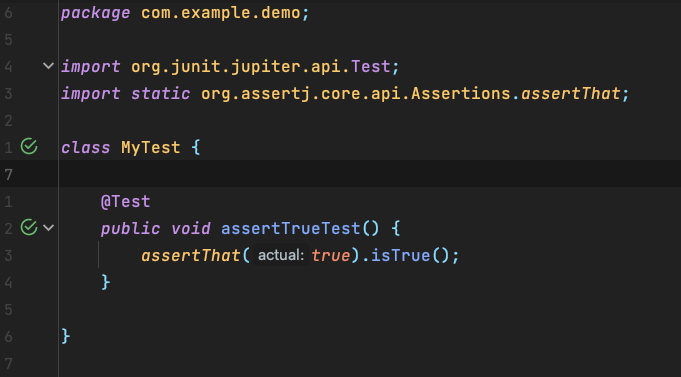
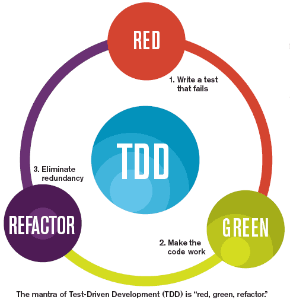
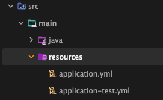

# 테스트

- 스프링이 개발자에게 제공하는 가장 중요한 가치는 **객체지향**과 **테스트**이다.
- 테스트는 개발자에게 코드의 확신을 주고, 변화에 유연하게 대처할 수 있는 자신감을 준다.

# 테스트의 유용성

- 만들어진 코드는 어떤 방법으로든 테스트해야 한다.
- 기존에 만들어진 동작하는 코드가 개선 과정 내내 기존과 동일하게 동작한다는 보장은 오직 테스트를 통해 확인하는 수밖에 없다.
- 테스트란 내가 의도했던 대로 코드가 정확히 동작하는지를 확인해서 만든 코드를 확신할 수 있게 해주는 작업이다.
- 테스트가 예상했던 의도대로 동작하지 않는다면 코드나 설계에 결함이 있음을 알 수 있고, 이를 통해 개선할 수 있다.

## `UserDaoTest`의 특징

```java
public class UserDaoTest {
  public static void main(String[] args) throws SQLException {
    ApplicationContext context = new GenericXmlApplicationContext("applicationContext.xml");

    UserDao dao = new UserDao();

    User user = new User();
    user.setId("whiteship");
    user.setName("백기선");
    user.setPassword("married");

    dao.add(user);

    System.out.println(user.getId() + " 등록 성공");

    User user2 = dao.get(user.getId());
    System.out.println(user2.getName());
    System.out.println(user2.getPassword());

    System.out.println(user2.getId() + " 조회 성공");
  }
}
```

- 자바에서 가장 손쉽게 실행 가능한 `main` 메서드를 이용한다.
- 테스트할 대상인 `UserDao`의 오브젝트를 가져와 메서드를 호출한다.
- 테스트에 사용할 입력 값을 직접 코드에서 만들어 넣어준다.
- 테스트 결과를 콘솔에 출력한다.
- 각 단계의 작업이 에러 없이 끝나면 콘솔에 성공 메세지로 출력해준다.

## 웹을 통한 DAO 테스트 방법의 문제점

- 웹이 동작하기 위한 최소한의 구성을 모두 해야한다.
	- 서비스, MVC 프레젠테이션 레이어
	- 동작하기 위한 웹서버 구성
- 직접 화면을 열어 폼을 띄우고 하나하나 다 직접 값을 입력하고 실행하는 방법으로는 반복적인 테스트를 하기에는 너무 시간이 오래 걸린다.
- 또한 버그가 발생했을 때, `DAO`뿐만 아니라 다른 곳에서 에러가 발생했을 가능성도 크다.

## 작은 단위의 테스트

- Unit Test: 작은 단위의 코드에 대해 테스트를 수행하는 것
- 테스트하고자 하는 대상이 명확하다면, 그 대상에만 집중해서 테스트 하는 것이 바람직하다.
	- 이는 곧 SoC 맥락과 같다.
- 단위의 범위는 정해진 것은 없지만, 일반적으로 작을 수록 좋다.
- 아마도 단위 테스트에서 가장 중요한 것은, 사이드 이펙트가 없는 것
	- 독립적으로 수행될 수 있어야 함
	- 멱등성
- 단위 테스트를 하는 이유는 개발자가 설계하고 만든 코드가 원래 의도한 대로 동작하는지를 개발자 스스로 빨리 확인받기 위함이다.
	- 따라서 확인의 대상과 조건이 간단하고 명확할 수록 좋다.

## 자동수행 테스트 코드

- 웹으로 테스트를 한다면, 테스트를 위한 사전작업이 너무 지루하고 불편하다는 점이다.
	- 화면을 띄우는 과정부터 데이터 입력, 폼 전송 등의 모든 과정을 직접 손으로 해야 된다는 점
- 이러한 모든 과정을 코드로 구성할 수 있다면 테스트를 쉽게 수행할 수 있다.
- 테스트를 자동으로 수행할 수 있어야 한다는 점은 매우 중요하다.
	- 결국 테스트를 수행하는 주체는 개발자이기 때문에, 이 과정이 간단하지 않다면 결국 안하게 될 것

## 지속적인 개선과 점진적인 개발을 위한 테스트

- 우선 정상동작하는 단순한 코드를 작성하고, 이를 테스트하는 테스트 코드를 작성했다면 그 뒤에 개선하는 과정에서 테스트의 성공 여부를 통해 올바르게 개선하고 있다는 확신을 얻을 수 있다.

## `UserDaoTest`의 문제점

- 웹에서 수행하는 테스트에 비해 훌륭하지만, 그래도 단점이 있다.
	- 여전히 사람의 눈으로 결과를 확인해야 함
	- `main()`으로 실행해야 하므로, 모든 테스트 코드가 `main()`을 갖게 된다면 프로그램 하나하나를 모두 실행해야 된다는 뜻이 된다.

# `UserDaoTest` 개선

## 테스트 검증의 자동화

- 눈으로 결과를 보고 성공, 실패 여부를 확인하지 말고 성공/실패 여부 자체를 출력하도록 코드로 구성하자.

```java
// before
User user2 = dao.get(user.getId());
System.out.println(user2.getName());
System.out.println(user2.getPassword());

// after
if (!user.getName().equals(user2.getName())) {
  System.out.println("테스트 실패 (name)");
} else if (!user.getPassword().equals(user2.getPassword())) {
  System.out.println("테스트 실패 (password)");
} else {
  // 이 코드가 출력되면 성공했다는 것을 알 수 있다.
  System.out.println("조회 테스트 성공");
}
```

## 테스트의 효율적인 수행과 결과 관리

- `main()` 으로 수행되는 테스트는 그 갯수가 많아질수록 관리하기 힘들어진다.
- 이를 쉽게 관리하기 위해서는 테스트를 위한 프레임워크를 사용하는 것이 좋다.

## `JUnit` 테스트로 전환

- 테스트 프레임워크
	- 프레임워크이므로, IoC이다.
	- `main()` 도 필요 없고, 개발자가 직접 테스트 코드를 인스턴스화 하여 실행할 필요도 없다.
	- 이 모든 것은 프레임워크에 의해 이뤄진다.

## JUnit Platform, Jupiter, Vintage

- JUnit5 부터 모듈이 세분화됨
	- Separation of Concerns

### Platform

- `TestEngine`을 실행시키기 위한 프레임워크, 플랫폼 역할
- `TestEngine` 은 인터페이스 이므로, 이를 구현함으로써 테스트가 실행되는 다양한 환경에 맞게 커스텀 할 수 있도록 함
	- ex) 테스트가 실행될 때 Docker 등을 이용하여 가상화 환경을 구성하고 테스트가 끝나는 경우 이 리소스를 정리하는 등의 작업

### Jupiter

- JUnit5에서 제공하는 `TestEngine` 구현체
- Java8을 위한 람다, 애노테이션 등 기능 제공

### Vintage

- 하위호환성을 위한 `TestEngine` 구현체

## 테스트 메서드 전환

- 기존에 `main()`에 작성한 코드를 프레임워크에 맞게 변경이 필요하다.
	- 테스트코드의 실행은 JUnit에 의해 이뤄지기 때문에, 테스트 프레임워크의 `main()`에 의해 실행되어야 한다.
- 프레임워크에 의해 실행될 수 있도록 두가지 규칙을 지켜야 한다.
	1. 메서드는 `public`으로 선언돼야 한다.
	2. `@Test` 애노테이션이 있어야 한다.

```java
import org.junit.jupiter.api.Test;

public class UserDaoTest {

  @Test
  public void addAndGet() throws SQLException {
    ApplicationContext context =
      new ClassPathXmlApplicationContext("applicationContext.xml");

      UserDao dao = context.getBean("userDao", UserDao.class);
      // ...
  }
}
```

## 단언문 라이브러리

- `if/else`로 테스트 하던 문장들을 JUnit이 제공하는 방법으로 전환하기 위해서는 단언(assertion)을 사용해야 한다.

### `AssertJ`

- 메서드 체인 방식으로 사용
- 가독성이 좋고, 확장성이 용이함

```java
assertThat(actual).isEqualTo(expected);
```

### `Hamcrest`

- 매처(Matcher) 형식으로 사용
- `AssertJ`보다 가볍지만 가독성이 좀 떨어지는 편
- 커스텀하기도 까다롭다고 함

```java
assertThat(actual, equalTo(expected));
```

## 검증 코드 전환

```java
import org.junit.jupiter.api.Test;
import static org.assertj.core.api.Assertions.assertThat;

public class UserDaoTest {

  @Test
  public void addAndGet() throws SQLException {
    ApplicationContext context =
      new ClassPathXmlApplicationContext("applicationContext.xml");

      UserDao dao = context.getBean("userDao", UserDao.class);
      User user = new User();
      user.setId("whiteship");
      user.setName("백기선");
      user.setPassword("married");

      dao.add(user);

      User user2 = dao.get(user.getId());

      assertThat(user2.getName()).isEqualTo(user.getName()));
      assertThat(user2.getPassword()).isEqualTo(user.getPassword()
  }
}
```

- `assertThat` 단언이 성공하면 JUnit이 테스트가 성공했다는 결과를 알려준다.

## JUnit 테스트 실행

- 일반적으로 `IntelliJ IDEA`로 스프링부트 프로젝트를 생성했다면, IDEA의 도움을 받아 손쉽게 실행할 수 있다.



- 구성된 프로젝트의 Gradle Wrapper 명령어는 다음과 같다.

```shell
$ ./gradlew test
```

- 이는 `gradle.build`에 정의된 `test` task를 실행한다.

```groovy
plugins {  
	id 'java'  
	id 'org.springframework.boot' version '3.1.1-SNAPSHOT'  
	id 'io.spring.dependency-management' version '1.1.0'  
}  
  
group = 'com.example'  
version = '0.0.1-SNAPSHOT'  
sourceCompatibility = '17'  
  
repositories {  
	mavenCentral()  
	maven { url 'https://repo.spring.io/milestone' }  
	maven { url 'https://repo.spring.io/snapshot' }  
}  
  
dependencies {  
	implementation 'org.springframework.boot:spring-boot-starter'  
	testImplementation 'org.springframework.boot:spring-boot-starter-test'  
}  
  
tasks.named('test') {  
	useJUnitPlatform()  
}
```

# 개발자를 위한 테스팅 프레임워크 JUnit

- 자바의 표준 테스팅 프레임워크이므로, 작성 방법과 실행방법을 잘 알고 있어야 함

## TDD

- Test Driven Development
- 테스트 주도 개발



1. 달성해야 할 목표를 테스트하는 코드를 먼저 작성
2. 테스트가 (당연히) 실패한 뒤, 테스트가 **성공하도록 촛점**을 맞춘 코드를 작성
3. 테스트가 성공하면 리팩토링

## 테스트 코드 작성시 지켜야 할 것 몇 가지

### 독립성, 격리성

- 가장 중요한 원칙!
- 테스트코드는 일반적으로 샌드박스로 취급되어야 한다.
- 따라서, 하나의 테스트가 다른 테스트에 영향을 주면 안 된다.
	- 이 원칙이 지켜진다면
		- 테스트코드는 순서에 상관없이 실행 될 수 있다.
		- 병렬적으로도 실행될 수 있다.
			- 이는 빠른 테스트 코드 실행을 의미한다.
			- 심지어, 분산된 환경에서도 테스트가 실행 가능하다는 의미다.

### 일관성

- 테스트 코드는 항상 일관되어야 한다.
	- 어떤 경우에는 성공하고, 어떤 경우에는 실패하는 상황이 발생하면 안 됨
- 마치 사이드이펙트가 없는 함수처럼 취급되어야 함
	- 같은 input에는 같은 output이 나와야 함
	- 일관성이 지켜지려면 당연히 독립성, 격리성 원칙이 지켜져야만 함

### 유지보수성

- 개발주기에 통합되어 지속적으로 관리될 수 있어야 함
	- 결국 **테스트 코드**임

### 유의미한 테스트

- 테스트 코드는 가치있는 테스트 코드와, 별 가치없는 테스트 코드로 나눌 수 있음
- 우리는 어플리케이션 개발자이고, 따라서 도메인 규칙이 올바른지 확인하는 테스트 코드가 중요성이 가장 높다고 볼 수 있음
- 코드 단위를 테스트 하는건 가치 없는 테스트일 확률이 높다. 이보다는 비즈니스 규칙, 즉 행위에 대한 테스트 코드를 작성해야만 한다.
	- 비즈니스 규칙인 행위를 검증하는 테스트는 코드 단위로 이루어져 있다.
	- 행위를 철저히 검증함으로써 간접적으로 코드 단위를 테스트하도록 해야 한다.

## Fixture

- 테스트 코드가 실행될 때의 환경을 구성하는 것
- 이는 테스트 코드의 일관성, 유지보수성에 도움이 된다.
	- 각각의 테스트를 위한 리소스 준비 및 정리 등의 작업

```java
// 예를 들어, Dao를 가져오는 작업은 모든 테스트 코드에 포함되어야 한다.
ApplicationContext context =
  new ClassPathXmlApplicationContext("applicationContext.xml");

  UserDao dao = context.getBean("userDao", UserDao.class);
```

```java
import org.junit.jupiter.api.Test;
import static org.assertj.core.api.Assertions.assertThat;

public class UserDaoTest {
  private UserDao dao;

  // fixture를 이용해
  // JUnit이 매 테스트마다 실행하도록 할 수 있다.
  @BeforeEach
  public void setUp() {
    ApplicationContext context =
      new ClassPathXmlApplicationContext("applicationContext.xml");

      this.dao = context.getBean("userDao", UserDao.class);
  }


  @Test
  public void addAndGet() throws SQLException {
      User user = new User();
      user.setId("whiteship");
      user.setName("백기선");
      user.setPassword("married");

      dao.add(user);

      User user2 = dao.get(user.getId());

      assertThat(user2.getName()).isEqualTo(user.getName()));
      assertThat(user2.getPassword()).isEqualTo(user.getPassword()
  }
}
```

> 참고로 JUnit은 `@Test`를 실행할 때마다 해당 클래스 인스턴스를 매 번 새로 생성한다(독립성 및 격리성).

# 스프링에서의 Fixture

- 각 테스트 코드가 서로 영향을 주지 않는 샌드박스 환경을 구성하려면 많은 리소스가 소비된다.
- 테스트 환경이 모두 독립적인게 좋지만, 자원은 한정되어 있다.
- 특히 만약 상태를 갖지 않는 오브젝트나 상태가 변하지 않는 불변객체들의 경우, 각각의 테스트 코드에서 재활용되어도 테스트의 독립성 및 일관성이 깨지지 않는다.
- 스프링의 경우 IoC 컨테이너인 애플리케이션 컨텍스트가 그 대상이 될 수 있다.
	- 생성하는데 큰 비용이 든다.
	- 초기화가 된 이후 상태가 변하지 않는 경우가 많다.
- 이를 위해 스프링은 테스트를 위한 애플리케이션 컨텍스트를 제공한다.

### `@SpringBootTest`

- 스프링부트 어플리케이션의 통합테스트(JUnit 프레임워크에서)를 위해  애노테이션
- 스프링부트 환경, 특히 테스트를 위한 애플리케이션 컨텍스트를 제공해준다.

```java
// ...

import org.junit.jupiter.api.extension.ExtendWith;

// ...

@Target(ElementType.TYPE)  
@Retention(RetentionPolicy.RUNTIME)  
@Documented  
@Inherited  
@BootstrapWith(SpringBootTestContextBootstrapper.class)

// @ExtendWith은 JUnit 애노테이션이다.
// 즉, SpringBootTest는 JUnit에 의존성을 갖고 있는 애노테이션이다.
@ExtendWith(SpringExtension.class)
public @interface SpringBootTest {
	// ...
}
```

```java
@SpringBootTest  
class UserDaoTest {  

// SpringBootTest 애노테이션 덕분에
// 스프링의 기능을 활용할 수 있다.
@Autowired
private ApplicationContext ctx;  
  
// ...
  
}
```

- `ApplicationContext`는 생성하는데 큰 비용이 든다.
- `@SpringBootTest`에 의해 딱 한 번만 생성되게 하고, 모든 테스트에서 공유하여 사용할 수 있게 된다.
	- 이를 통해 테스트 코드의 실행속도를 개선할 수 있다.

```shell
org.springframework.context.annotation.AnnotationConfigApplicationContext@4a8b5227, started on Sun Jun 11 22:08:23 KST 2023
com.example.demo.UserDaoTest@3b2e5c0d
org.springframework.context.annotation.AnnotationConfigApplicationContext@4a8b5227, started on Sun Jun 11 22:08:23 KST 2023
com.example.demo.UserDaoTest@39dec536
org.springframework.context.annotation.AnnotationConfigApplicationContext@4a8b5227, started on Sun Jun 11 22:08:23 KST 2023
com.example.demo.UserDaoTest@4cb957b8
```

- 각 테스트 케이스마다 `UserDaoTest`는 새로 생성되지만, `ApplicationContext`는 같은 객체를 유지하고 있음을 확인할 수 있다.

## `@Autowired`

- IoC 컨테이너에 의해 DI 받도록 한다.
- 그런데, `ApplicationContext` 가 IoC인데 어떻게 주입받는다는 것인가?
	- IoC 컨테이너는 자기 자신도 빈으로 등록한다.
	- 따라서, `ApplicationContext` 타입이 필요할 때 컨테이너 자신(`this`)을 주입 해줄 수 있는 것이다.
- 어차피 `ApplicationContext`에서 빈을 가져와야 한다면, 그냥 빈 자체를 주입받는게 더 편하다.

```java
@SpringBootTest  
class UserDaoTest {  

// ApplicationContext 대신에
// 그냥 UserDao를 주입받자!
@Autowired
private UserDao dao;
  
// ...
  
}
```

## 인터페이스에 의존하기

- `@Autowired`는 IoC컨테이너에 등록된 빈들 중, 할당 가능한 빈을 찾아 주입해준다.
- 따라서 구체 클래스가 아니라 인터페이스를 통해서도 주입이 가능하다.
- 인터페이스 타입을 통해 DI를 받으면, 구현에 의존하지 않을 수 있다.
	- 따라서 필요에 의해 구현을 항상 변경할 수 있다.
- 따라서, 실제 애플리케이션 코드를 작성할 때 구체 클래스를 노출하지 말고, 인터페이스를 통해 느슨하게 결합한 코드를 작성하게 된다면 테스트할 수 있게 된다.

## `@DirtiesContext`

- `ApplicationContext`의 상태가 테스트 중에 변경된다면, 다른 테스트에는 사용되면 안 된다.
- 따라서 이런 경우에는 스프링 테스트 컨텍스트 프레임워크가 다른 테스트와 `ApplicationContext`를 공유하지 않게 한다.

## 테스트를 위한 별도의 DI 설정

- 테스트용 설정파일을 분리함으로써 테스트에 사용되는 `ApplicationContext`를 따로 구성할 수 있다.
- Spring Boot의 경우, 기본적으로 `application-{profile}` 파일을 자동으로 로드하므로, 이를 이용하면 테스트 환경을 위한 Profile을 손쉽게 구성할 수 있다.



```java
@SpringBootTest
@ActiveProfiles("test")
class UserDaoTest {  

@Autowired
private ApplicationContext ctx;  
  
// ...
  
}
```

## DI를 이용한 테스트 방법 선택

- 스프링 컨테이너 없이 테스트할 수 있는 방법을 먼저 고려하자
	- 테스트 속도가 가장 빠름
	- 스프링 컨테이너에 의한 사이드 이펙트가 없으므로, 테스트 하기가 수월함
- 의존성이 있는 오브젝트들의 경우 스프링 컨테이너 활용을 고려하자.
	- 복잡한 의존관계를 직접 설정하는 것보다 컨테이너의 능력을 활용하는 게 낫다.

# 학습 테스트로 배우는 스프링

- 테스트 코드 역시 코드이다.
- 테스트 코드로 사용할 API나 라이브러리, 프레임워크 코드를 작성하면서 학습하는 테스트를 학습 테스트라고 한다.
- 이는 자신이 얼마나 제대로 이해하고 있는지 검증할 수 있다.
- 일반적으로 테스트는 대상의 행위에 집중했다면, 학습 테스트는 테스트 코드 자체에 관심을 가져야 한다.

## 학습 테스트의 장점

- 특정 기술을 이용해 간단한 예제 프로그램을 만들면서 익힐 수도 있지만, 학습 테스트를 통해 기술을 익히면 얻는 장점이 있다.

### 다양한 조건에 따른 기능을 손쉽게 확인해볼 수 있다.

- 테스트 프레임워크의 도움을 받으면 테스트의 수행을 자동화할 수 있다.
- 예제 프로그램을 만들면서 학습하는 경우, 조건에 따른 동작을 확인하기 위해서는 수동으로 값을 변경하여 테스트 해봐야 한다.
- 테스트 코드를 이용하면 그럴 필요가 없으며, 특정 입력값에 대해 어떻게 동작하는지를 항상 확인할 수 있다.

### 학습 테스트 코드를 개발 중에 참고할 수 있다.

- 예제 프로그램은 과정의 코드 기록이 남아 있지 않고, 최종 결과 코드만이 남게 된다.
- 학습 테스트 코드는 동작 하나하나에 대해 작성한 코드의 이력이 모두 남아 있어, 이를 레퍼런스나 문서와 같이 참고할 수 있다.

### 프레임워크나 제품을 업그레이드할 때 호환성 검증을 도와준다.

- 작성된 학습 테스트 코드는 추후 라이브러리, 프레임워크 등의 버전을 업그레이드할 때, 기존 동작에 대한 호환성을 검증해주는 역할을 한다.
	- 물론 현재 애플리케이션 내에서 사용되는 기능들에 대해 학습 테스트 코드가 충분히 작성되어야만 가능한 일이다.

### 테스트 작성에 대한 좋은 훈련이 된다.

- 결국 학습 테스트 코드도 테스트 코드를 작성하는 것이므로, 훈련이 된다.

### 새로운 기술을 공부하는 과정이 즐거워진다.

- 동작하는 코드를 직접 작성하고, 통과된 테스트에 희열(?)을 느껴 즐거움을 느낄 수 있다.


## 버그 테스트

- 버그가 발생한 경우, 해당 버그가 발생한 환경에 대한 조건으로 테스트를 만들고, 이 테스트를 통과시키게 테스트 코드를 작성하면 버그가 수정됐음을 쉽게 확인할 수 있다.
