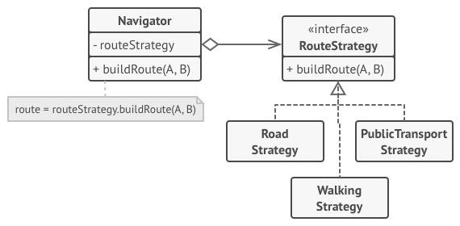
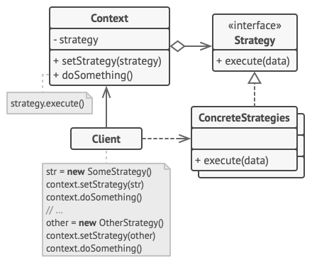
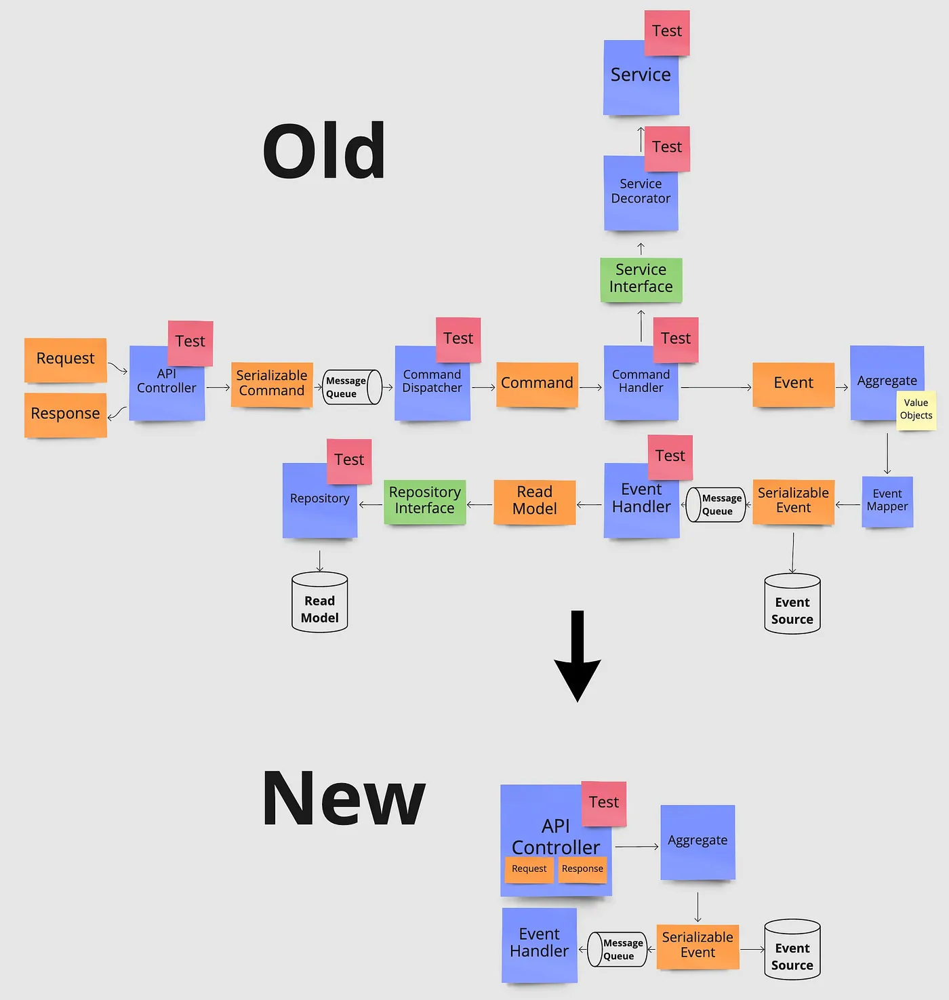
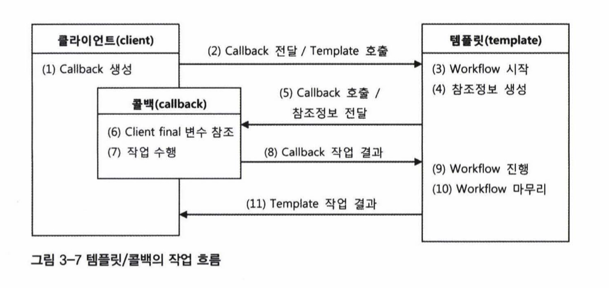
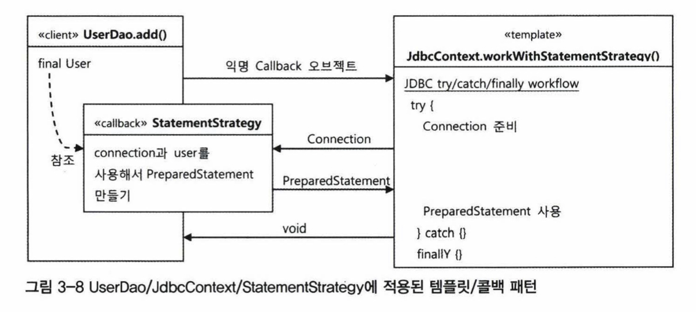

- 변경되지 않는 부분을 변경되는 부분과 분리하여 계속 재활용 가능하도록 한다.

# 3.1 다시 보는 초난감 DAO

## 3.1.1 예외처리 기능을 갖춘 DAO

- DB 커넥션을 통해 작업을 하고 나면 항상 리소스를 정리해야 한다.
	- 이는 작업의 성공/실패 여부와 관계없이 항상 이루어져야만 한다.

### 수정(삭제) 예외처리

```java
public void deleteAll() throws SQLException {
  Connection c = dataSource.getConnection();

  // ------------------------------------------------------------
  // 이 영역에서 예외가 발생하는 경우, 리소스 반환이 이뤄지지 않는다.
  PreparedStatement ps = c.prepareStatement("delete from users");
  ps.executeUpdate();
  // ------------------------------------------------------------

  ps.close();
  c.close();
}
```

```java
public void deleteAll() throws SQLException {
  Connection c = null;
  PreparedStatement ps = null;

  try {
    c = dataSource.getConnection();
    ps = c.prepareStatement("delete from users");
    ps.executeUpdate();
    
  } catch (SQLException e) {
    throw e;
  } finally {
    if (ps != null) {
      try {
        ps.close();
      } catch (SQLException e) {
        // Logging
      }
    }
    if (c != null) {
      try {
        c.close();
      } catch (SQLException e) {
        // Logging
      }
    }
  }
}
```

- `close()` 실패는 더 이상 예외를 처리할 방법이 없다. 이런 경우에는 그냥 로그를 찍는것이 최선책이다.

### 조회 예외처리

- 위와 기본적으로 구성은 같지만, 조회된 뒤의 `ResultSet` 역시 `close()`를 호출해줘야 된다는 점을 유의해야 한다.

```java
public int getCount() throws SQLException {
  Connection c = null;
  PreparedStatement ps = null;
  ResultSet rs = null;

  try {
    c = dataSource.getConnection();

    ps = c.prepareStatement("select count(*) from users");

    rs = ps.executeQuery();
    rs.next();
    return rs.getInt(1);
    
  } catch (SQLException e) {
    throw e;
  } finally {
    if (rs != null) {
      try {
        rs.close();
      } catch (SQLException e) {
        // Logging
      }
    }
    if (ps != null) {
      try {
        ps.close();
      } catch (SQLException e) {
        // Logging
      }
    }
    if (c != null) {
      try {
        c.close();
      } catch (SQLException e) {
        // Logging
      }
    }
  }
}
```

# 3.2 변하는 것과 변하지 않는 것

## 3.2.1 JDBC try/catch/finally 코드의 문제점

- 너무 nested 되어 있어 코드를 파악하기 힘들다.
- 같은 코드가 지속적으로 반복된다.
- 이런 경우 비즈니스 로직이 조금만 복잡해져도, 디버깅하기가 매우 힘들어진다.

### 3.2.2 분리와 재사용을 위한 디자인 패턴 적용

- 중복코드를 제거하는 것이 기본
	- 변하지 않는 부분을 추출하자.

```java
public void deleteAll() throws SQLException {
  Connection c = null;
  PreparedStatement ps = null;

  try {
    c = dataSource.getConnection();

    // 이 쿼리가 포함된 부분만 변경될 것이고, 나머지는 항상 같을 것이다.
    ps = c.prepareStatement("delete from users");

    ps.executeUpdate();
    
  } catch (SQLException e) {
    throw e;
  } finally {
    if (ps != null) {
      try {
        ps.close();
      } catch (SQLException e) {
        // Logging
      }
    }
    if (c != null) {
      try {
        c.close();
      } catch (SQLException e) {
        // Logging
      }
    }
  }
}
```

### 메서드 추출

- 보통은 반복되는 부분을 추출하지만 반복되는 부분인 변하지 않는 부분이 변하는 부분을 감싸고 있기 때문에, 반대로 추출해보자.

```java
public void deleteAll() throws SQLException {
  Connection c = null;
  PreparedStatement ps = null;

  try {
    c = dataSource.getConnection();

	// 변하는 부분을 추출
    ps = makeStatement(c);

    ps.executeUpdate();
    
  } catch (SQLException e) {
    throw e;
  } finally {
    if (ps != null) {
      try {
        ps.close();
      } catch (SQLException e) {
        // Logging
      }
    }
    if (c != null) {
      try {
        c.close();
      } catch (SQLException e) {
        // Logging
      }
    }
  }
}

// 추출된 메서드
private PreparedStatement makeStatement(Connection c) throws SQLException {
  PreparedStatement ps;
  ps = c.prepareStatement("delete from users");
  return ps;
}
```

- 추출된 메서드를 재활용할 수 있어야 하는데, 딱히 재활용할 수 있는 여지가 보이지 않는다.
- 쿼리를 매개변수로 받는다고 해도, 결국 `try/catch/finally` 블록은 새로 추가되는 모든 메서드에 똑같이 들어갈 것이다.
- 템플릿 메서드 패턴을 적용해보자.

### 템플릿 메서드 패턴의 적용

- 상속을 통해 기능을 확장하는 패턴이다.
- 변하지 않는 부분을 슈퍼클래스에 두고, 변하는 부분을 추상 메서드로 정의해서 서브클래스가 이를 구현하도록 강제한다.

```java
abstract class UserDao {

	// ...
	
	abstract protected PreparedStatement makeStatement(Connection c) throws SQLException;
}

public class UserDaoDeleteAll extends UserDao {

	protected PreparedStatement makeStatement(Connection c) throws SQLException {
		PreparedStatement = ps = c.preparedStatement("delete from users");

		return ps;
	}
}
```

- 하지만 이 경우, 새로운 로직을 추가할 때마다 `UserDao`를 상속하는 새로운 서브클래스를 계속 정의해야 된다는 단점이 있다.
- 이럴바에는 차라리 그냥 메서드를 추가하는 편이 더 나을 것 같다.
- 또한 서브클래스의 가장 큰 단점인 슈퍼클래스와 강하게 구조적으로 결합한다는 점 때문에 유연성이 떨어진다.

### 전략 패턴의 적용

- 오브젝트를 분리하고 인터페이스로만 의존하게 만드는 전략 패턴이 템플릿 메서드 패턴보다 훨씬 더 유연하고 확장성이 뛰어나다.
- 변하지 않는 부분이 컨텍스트가 되고, 변하는 부분이 전략이 되어 확장이 필요한 부분에서 컨텍스트가 전략을 사용하게 한다.

#### `deleteAll()`의 컨텍스트

- DB 커넥션 가져오기
- `PreparedStatement`를 만들어줄 외부 기능 호출하기
- 전달받은 `PreparedStatement` 실행하기
- 예외가 발생하면 이를 메서드 밖으로 던지기
- 모든 경우에 만들어진 `PreparedStatement`와 `Connection`을 적절히 닫아주기



```java
public interface StatementStrategy {
	PreparedStatement makePreparedStatement(Connection c) throws SQLException;
}

public class DeleteAllStatements implements StatementStrategy {
  public PreparedStatement makePreparedStatement(Connection c) throws SQLException {
    return c.prepareStatement("delete from users");
  }
}
```

```java
public void deleteAll() throws SQLException {
  Connection c = null;
  PreparedStatement ps = null;

  try {
    c = dataSource.getConnection();

	// 전략 객체를 직접 생성
    StatementStrategy strategy = new DeleteAllStrategy();
    ps = strategy.makePreparedStatement(c);

    ps.executeUpdate();
    
  } catch (SQLException e) {
    throw e;
  } finally {
    if (ps != null) {
      try {
        ps.close();
      } catch (SQLException e) {
        // Logging
      }
    }
    if (c != null) {
      try {
        c.close();
      } catch (SQLException e) {
        // Logging
      }
    }
  }
}
```

- 하지만 이 코드에는 여전히 문제가 있는데, `DeleteAllStrategy` 라는 구체 클래스에 의존하고 있다는 점이다.

### DI 적용을 위한 클라이언트/컨텍스트 분리

- 컨텍스트가 사용할 전략은 컨텍스트를 사용하는 클라이언트가 결정한다.
	- 사용할 전략을 컨텍스트로 전달한다.



- 결국은 DI
	- IoC컨테이너: Client
	- Bean: Strategy
	- 우리의 코드: Context
- 변하지 않는 컨텍스트 코드가 전략을 주입받아야 하므로, 메서드로 분리한다.

```java
public void jdbcContextWithStatementStrategy(StatementStrategy stmt) throws SQLException {

  Connection c = null;
  PreparedStatement ps = null;
  
  try {
    c = dataSource.getConnection();
    ps = stmt.makePreparedStatement(c);
    ps.executeUpdate();
  } catch (SQLException e) {
    throw e;
  } finally {
    if (ps != null) { try { ps.close(); } catch (SQLException e) { } }
    if (c != null) { try { c.close(); } catch (SQLException e) { } }
  }
}

public void deleteAll() throws SQLException {
  StatementStrategy st = new DeleteAllStatement();
  jdbcContextWithStatementStrategy(st);
}
```

# 3.3 JDBC 전략 패턴의 최적화

## 3.3.1 전략 클래스의 추가 정보

- 같은 방식으로 INSERT 상황에도 적용시켜보자.

```java
public class AddStatement implements StatementStrategy {
  public PreparedStatement makePreparedStatement(Connection c) throws SQLException {
    PreparedStatement ps = c.prepareStatement(
      "insert into users(id, name, password) values(?,?,?)");

    ps.setString(1, user.getId());
    ps.setString(2, user.getName());
    ps.setString(3, user.getPassword());

    return ps;
  }

}
```

- `user` 가 필요하다. 이를 생성자로 받게 하자.

```java
public class AddStatement implements StatementStrategy {
  User user;

  public AddStatement(User user) {
    this.user = user;
  }

  public PreparedStatement makePreparedStatement(Connection c) throws SQLException {
    PreparedStatement ps = c.prepareStatement(
      "insert into users(id, name, password) values(?,?,?)");

    ps.setString(1, user.getId());
    ps.setString(2, user.getName());
    ps.setString(3, user.getPassword());

    return ps;
  }

}
```

```java
public void add(User user) throws SQLException {
  StatementStrategy st = new AddStatement(user);
  jdbcContextWithStatementStrategy(st);
}
```

## 3.2.2 전략과 클라이언트의 동거

- 현재까지 코드의 문제점은 다음과 같다.
	1. 각 오퍼레이션마다 새로운 `StatementStrategy` 구현 클래스를 정의해야 한다.
		- 클래스 파일이 비약적으로 늘어날 것이다.
	2. 위의 `user`의 경우 처럼, 다른 의존성이 필요한 경우 이를 생성자로 받도록 각 클래스마다 모두 구현해야만 한다.

### 로컬 클래스

- 클래스 파일을 새로 만들지 말고, 내부 클래스로 정의해버리면 클래스 파일이 비약적으로 늘어나는 것은 막을 수 있다.

```java
public void add(User user) throws SQLException {
  class AddStatement implements StatementStrategy {
    User user;

    public AddStatement(User user) {
      this.user = user;
    }

    public PreparedStatement makePreparedStatement(Connection c) throws SQLException {
      PreparedStatement ps = c.prepareStatement(
        "insert into users(id, name, password) values(?, ?, ?)");
      ps.setString(1, user.getId());
      ps.setString(2, user.getName());
      ps.setString(3, user.getPassword());

      return ps;
    }
  }

  StatementStrategy st = new AddStatement(user);
  jdbcContextWithStatementStrategy(st);
}
```

- 메서드에 정의된 클래스는 해당 메서드 스코프에 접근할 수 있다.
	- 단, `final`이어야만 한다.
- 이를 이용하면 `user` 를 생성자로부터 받지 않고 바로 사용할 수 있다.

```java
public void add(final User user) throws SQLException {
  class AddStatement implements StatementStrategy {
    public PreparedStatement makePreparedStatement(Connection c) throws SQLException {
      PreparedStatement ps = c.prepareStatement(
        "insert into users(id, name, password) values(?, ?, ?)");
      ps.setString(1, user.getId());
      ps.setString(2, user.getName());
      ps.setString(3, user.getPassword());

      return ps;
    }
  }

  StatementStrategy st = new AddStatement();
  jdbcContextWithStatementStrategy(st);
}
```

### 익명 내부 클래스

- `add` 내에서만 한 번 사용되는 클래스라면 굳이 이름이 있을 필요가 없다.
- 자바는 익명 내부 클래스 문법을 지원한다.

```java
public void add(final User user) throws SQLException {
  StatementStrategy st = new StatementStrategy() {
    public PreparedStatement makePreparedStatement(Connection c) throws SQLException {
      PreparedStatement ps = c.prepareStatement("insert into users(id, name, password) values(?, ?, ?)");
      ps.setString(1, user.getId());
      ps.setString(2, user.getName());
      ps.setString(3, user.getPassword());
      return ps;
    }
  }
  
  jdbcContextWithStatementStrategy(st);
}
```

- 더 욕심내면, `st` 로컬변수 자체를 지워버릴 수도 있다.

```java
public void add(final User user) throws SQLException {
  jdbcContextWithStatementStrategy(
    new StatementStrategy() {
      public PreparedStatement makePreparedStatement(Connection c) throws SQLException {
        PreparedStatement ps = c.prepareStatement("insert into users(id, name, password) values(?, ?, ?)");
        ps.setString(1, user.getId());
        ps.setString(2, user.getName());
        ps.setString(3, user.getPassword());
        return ps;
      }
    }
  );
}
```

- 자바8부터는 람다로 만들 수 있다.

```java
public void add(final User user) throws SQLException {
  jdbcContextWithStatementStrategy(c -> {
    PreparedStatement ps = c.prepareStatement("insert into users(id, name, password) values(?, ?, ?)");
    ps.setString(1, user.getId());
    ps.setString(2, user.getName());
    ps.setString(3, user.getPassword());
    return ps;
  });
}

```

# 3.4 컨텍스트와 DI

- `jdbcContextWithStatementStrategy` 메서드는 JDBC의 일반적인 실행 맥락을 담고 있으므로,  `UserDao`에서만 사용될 이유는 없다.

### 클래스 분리

```java
public class JdbcContext {
  private DataSource dataSource;

  public void setDataSource(DataSource dataSource) {
    this.dataSource = dataSource;
  }

  public void workWithStatementStrategy(StatementStrategy statementStrategy) throws SQLException {
    Connection connection = null;
    PreparedStatement preparedStatement = null;

    try {
      connection = dataSource.getConnection();
      preparedStatement = statementStrategy.makePreparedStatement(connection);
      preparedStatement.executeUpdate();
    } catch (SQLException e) {
      throw e;
    } finally {
      if (preparedStatement != null) {
        try {
          preparedStatement.close();
        } catch (SQLException e) {
          // Logging
        }
      }
      if (connection != null) {
        try {
          connection.close();
        } catch (SQLException e) {
          // Logging
        }
      }
    }
  }
}
```

- `UserDao`의 메서드가 `JdbcContext`의 클라이언트이므로, 해당 메서드에서 `JdbcContext`를 사용할 수 있도록 DI를 받게 하자.

```java
public class UserDao {
  private JdbcContext jdbcContext;

  public void setJdbcContext(JdbcContext jdbcContext) {
    this.jdbcContext = jdbcContext;
  }

  // ...
}
```

## 3.4.2 `JdbcContext`의 특별한 DI

- 우리는 `JdbcContext`를 인터페이스로 정의하지 않고, 구체클래스로 정의했다.
- 그리고 해당 구체클래스를 DI 받도록 했다. 이는 문제가 없을까?
- 무조건 인터페이스를 사용하는 것이 좋은 것은 아니다.
	- 인터페이스를 사용하는 근본적인 이유는 구현의 변경 및 대체 가능성이다.
	- 사실상 대부분의 소프트웨어는 변경의 가능성이 있지만, `JdbcContext`와 같이 특정 기술에 강한 종속성을 가진 클래스의 경우, 기술이 변경되면 구현 자체가 변경되므로 굳이 인터페이스를 둘 필요는 없다.


- [Avoiding Premature Software Abstractions](https://medium.com/better-programming/avoiding-premature-software-abstractions-8ba2e990930a)
- [Fundamental theorem of software engineering](https://en.wikipedia.org/wiki/Fundamental_theorem_of_software_engineering)

### 코드를 이용하는 수동 DI

- 스프링 빈으로 `JdbcContext`를 등록하지 않고 사용하고자 한다면, `UserDao`가 `JdbcContext`의 라이프사이클을 직접 책임지게 해도 된다.
- 이 경우, `JdbcContext`가 필요로하는 `DataSource`를 `UserDao`가 DI 받아서 `JdbcContext`에 넘겨주면 된다.
	- 인스턴스 생성의 책임이 있는 클래스가 해당 인스턴스의 의존성을 책임져야 한다.
- 이렇게 하면 스프링 빈 설정에서 `JdbcContext`는 제외해도 된다.
	- 단, `DataSource`는 여전히 존재해야 한다.
- 어느 방법이 더 좋다고 단정지을 수 없다.
	- 항상 상황에 따라, 합당한 근거를 가지고 선택하면 된다.

# 3.5 템플릿과 콜백

- 지금까지 한 방식을 **템플릿/콜백** 패턴이라 한다.
- 변하지 않는 컨텍스트가 있고, 이 컨텍스트에서 변경되는 부분을 익명 내부 클래스(전략)로 받아 컨텍스트에서 호출되는 구조다.
- 람다를 사용하는 코드로 작성하면, 조금 더 콜백의 의미가 두드러지게 나타난다.

## 3.5.1 템플릿/콜백의 동작원리





## 3.5.2 편리한 콜백의 재활용

- 익명 내부 클래스를 이용한 코드는 보기가 불편하다는 단점이 있다.
	- 람다로 해결!

### 콜백의 분리와 재활용

- 사실, 콜백도 자세히 살펴보면 쿼리 부분만 바뀐다. 따라서 더 개선할 여지가 있다.

```java
public class UserDao {
  // ...

  public void deleteAll() throws SQLException {
    executeSql("delete from user");
  }

  private void executeSql(final String query) throws SQLException {
    this.jdbcContext.workWithStatementStrategy(new StatementStrategy() {
      @Override
      public PreparedStatement makePreparedStatement(Connection connection) throws SQLException {
        return connection.prepareStatement(query);
      }
    });
  }
}
```

### 콜백과 템플릿의 결합

- `executeSql`은 `UserDao`와 아무런 의존관계가 없다.
- 이를 `JdbcContext`로 옮기면, 이제 `JdbcContext`를 사용하는 모든 곳에서 사용할 수 있다.

## 3.5.3 템플릿/콜백의 응용

- 템플릿/콜백 패턴은 스프링의 전유물은 아니다.
- 책이 쓰여질 당시에는 몰라도, 요즘은 어디에서나 쉽게 볼 수 있는 디자인 패턴이다.
	- 프론트엔드 영역에서는 너무 밥먹듯이 사용한다.
- 특히 자바8 이후로는 람다로 간결하게 사용할 수 있게 되어, 크게 새로울 것도 없다.
- ~~따라서 이하 정리 생략~~

# 3.6 스프링의 `JdbcTemplate`

- 스프링에서는 `JdbcContext`와 같은 방식으로 구현된 `JdbcTemplate`을 제공한다.

```java
public class UserDao {
  // ...

  private JdbcTemplate jdbcTemplate;

  public void setDataSource(DataSource dataSource) {
    this.jdbcTemplate = new JdbcTemplate(dataSource);

    this.dataSource = dataSource;
  }
}
```

## 3.6.1 `update()`

```java
public class UserDao {
  // ...

  public void deleteAll() {
    this.jdbcTemplate.update(
      new PreparedStatementCreator() {
        @Override
        public PreparedStatement createPreparedStatement(Connection connection) throws SQLException {
          return connection.prepareStatement("delete from users");
        }
      }
    )
  }
}
```

- 자바 8부터는 람다로 할 수 있다.

```java
public class UserDao {
  // ...

  public void deleteAll() {
    this.jdbcTemplate.update(connection -> connection.prepareStatement("delete from users"));
  }
}
```

- 쿼리 `String`을 넘길 수도 있다.

```java
public class UserDao {
  // ...

  public void deleteAll() {
    this.jdbcTemplate.update("delete from users");
  }
}
```

## 3.6.2 ~~`queryForInt()`~~

> `Deprecated` 됐다. `queryForObject`를 사용해야 한다.

- `SELECT` 쿼리의 경우, 결과(`ResultSet`)를 받아서 이를 통해 우리의 오브젝트로 변환하는 과정이 필요하다.
- 이를 위해 `JdbcTemplate`은 두 개의 콜백을 매개변수로 받는다.
	- 하나는 쿼리를 생성하는 콜백
	- 하나는 결과를 받는 콜백

```java
public class UserDao {
  // ...

  public int getCount() {
    return this.jdbcTemplate.query(
      connection -> connection.prepareStatement("select count(*) from users"),
      resultSet -> {
        resultSet.next();
        return resultSet.getInt(1);
	  }
	);
  }
}
```

- `JdbcTemplate`은 정해진 타입을 리턴하게 하는 방식도 제공한다.

```java
public class UserDao {
  // ...

  public int getCount() {
    return this.jdbcTemplate.queryForInt("select count(*) from users");
  }
}
```

- `deprecated` 됐으므로, `queryForObject()` 를 사용해야 한다.

```java
public class UserDao {
	// ...
	
    public int getCount() {
        return this.jdbcTemplate.queryForObject("select count(*) from users", Integer.class);
    }
}

```

### 3.6.3 `queryForObject()`

> 책의 예제는 `deprecated` 된 코드다.

- `get()` 을 `JdbcTemplate`으로 변경하려면, 가변인자를 처리해야 한다.

```java
public class UserDao {
	// ...
	
    public User get(String id) {
        return jdbcTemplate.queryForObject(
                "SELECT * FROM users WHERE id = ?",
                (rs, rowNum) -> new User(
                        rs.getString("id"),
                        rs.getString("name"),
                        rs.getString("password")
                ),
                id // `?` 에 들어갈 값
        );
    }
}
```

## 3.6.4 `query()`

- `queryForObject()`는 결과 row가 하나일 때 사용하고, 여러개인 경우 `query()`를 사용할 수 있다.

```java
public class UserDao {
	// ...
	
    public List<User> getAll() {
        return jdbcTemplate.query(
                "SELECT * FROM users",
                (rs, rowNum) -> new User(
                        rs.getString("id"),
                        rs.getString("name"),
                        rs.getString("password")
                )
        );
    }
}
```

> 사실 이제는 `JdbcTemplate`을 실무에서 사용하지 않는 것으로 알고 있다. 이하 테스트와 관련된 주제나 람다로 호출됐던 `RowMapper` 등의 리팩토링 작업과 관련된 내용은 정리하는게 큰 의미가 없겠다고 생각하여 여기까지 정리하도록 한다.

