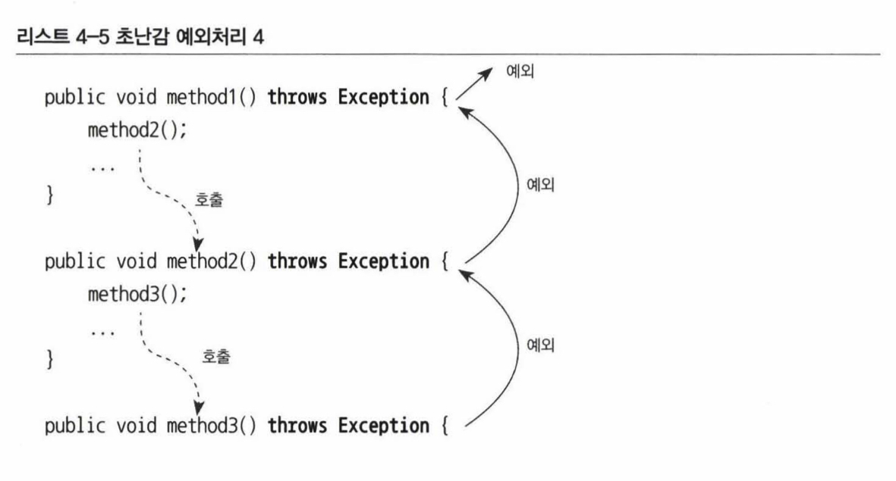
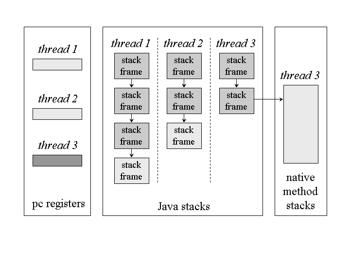
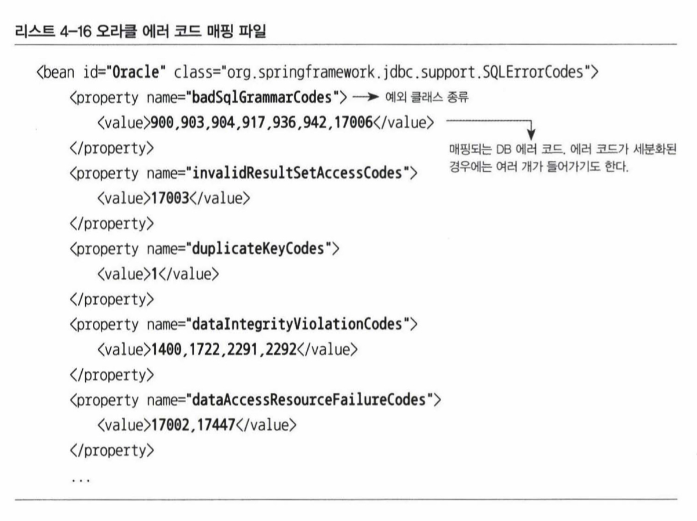
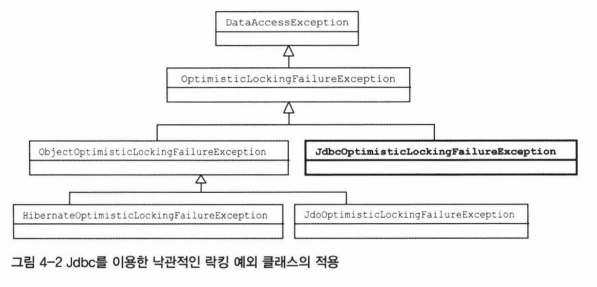
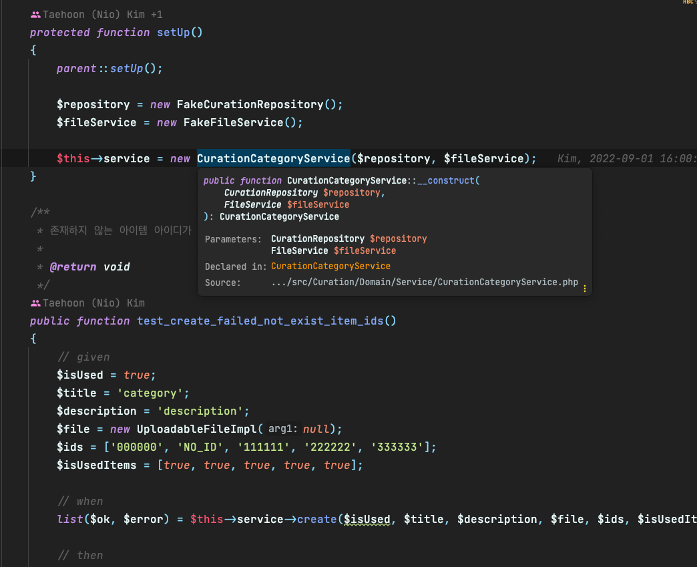
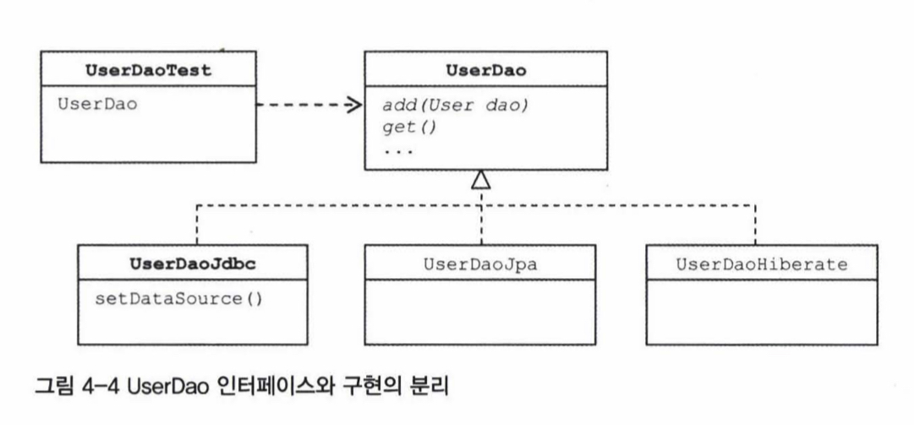

# 4장. 예외

- 프로그램의 정상적 흐름과 벗어난 오류
- 예외를 처리하는 방법은 프로그래밍 언어마다 스타일이 다를 수 있다.
- 일반적으로 대부분의 언어는 `try/catch` 문을 사용한다.
	- 그 외 언어들은 에러에 관한 정보를 리턴하는 형식으로 에러처리를 한다.

# 4.1 사라진 `SQLException`

- 스프링이 제공하는 `JDBCTemplate`을 사용하면 `SQLException`을 사용하지 않아도 된다.

```java
@Repository
public class UserDao {
	// ...
	
    public void deleteAll() /* throws SQLException */ {
        this.jdbcTemplate.update("delete from users");
    }
}
```

## 4.1.1 초난감 예외처리

### 예외 블랙홀

- 예외를 처리하지 않는 코드
	- 예외를 잡고 아무것도 안하거나
	- 단순히 콘솔만 찍거나 등

```java
try {
	// ...
} catch (Exception e) {
}
```

- 예외는 반드시 보고되어야만 한다.
- 보고하지 않을바엔 프로그램을 터뜨리는게 더 나을 수도 있다.

```java
try {
	// ...
} catch (Exception e) {
	System.exit(1);
}
```

### 무의미하고 무책임한 throws



## 4.1.2 예외의 종류와 특징

### `Error`

- 시스템 문제
- 주로 JVM에서 발생하는 에러
- 이는 어플리케이션 레벨에서 처리가 불가능함
	- `OutOfMemoryError`
	- `ThreadDeath` 등

## Checked / Unchecked Exception

### Checked Exception

- 컴파일 레벨에서 확인하여 예외처리를 강제하는 예외
- `RuntimeException`이 아닌 예외
- 이 예외는 반드시 예외를 처리하거나, 그렇지 않으면 해당 처리를 위임하도록 메서드에 `throws` 로 해당 메서드의 클라이언트에 예외를 위임시킨다.

### Unchecked Exception

- 예외처리가 강제되지 않는 예외
- `RuntimeException`

### Checked Exception은 사용하지 않는 추세

- 예외 처리에 대한 코드가 너무 지저분해짐
	- Layered architecture에서 예외를 위임하여 특정 레이어에서 처리되어야할 경우가 많음
	- 이 경우, 해당 operation에 관여하는 모든 메서드는 `throws` 키워드를 써야만 함
	- 이는 매우 번거롭고 코드 가독성이 떨어지게 됨
- 함수형/비동기 프로그래밍의 유행
	- 함수형의 경우 예외 자체가 사이드 이펙트
		- 함수형은 순수해야함
			- 불변성
			- 입력이 같으면 출력이 같다.
		- 예외는 애초에 개념부터가 순수하지 않음
			- 특정 프로그램 흐름에서 "예외"적인 상황임
			- 같은 입력에 대해 다른 출력이 나올 수도 있다는 얘기
	- 비동기의 경우 예외 처리가 너무 복잡함
		- 비동기는 실행 시점이 불분명함
			- 예외가 전파될 때, 호출된 함수 스택에 따라 전파됨
			- 비동기 코드는 일반적으로 동시성과 관련되어 있으며, 따라서 해당 코드의 실행은 호출 함수의 스택과 별개로 돌아갈 수 있음
				- 이는 일반적인 예외전파가 불가능하다는 뜻

			

- 자바와 100% 호환을 하는 코틀린의 경우 Checked Exception 개념을 없앰
- 그 외 자바 패키지들은 예외를 `RuntimeExeption`을 상속받아 Unchecked Exception으로 만드는 경우가 대부분

## 4.1.3 예외처리 방법

### 예외 복구

- 예외상황을 파악하고 문제를 해결하여 정상 상태로 돌려놓는 것
	- File I/O 관련 Exception
	- 네트워크 관련 Exception
	- 위와 같은 예외들은 사용자에게 피드백을 주고 다른 작업흐름으로 프로그램을 실행함으로써 정상 상태를 유지할 수 있다.

### 예외처리 회피

- 그냥 던져버리기
	- 예외 처리 책임이 없는 메서드가 의도적으로 던지는 행위여야만 한다.

![[throw-man.png]]

### 예외 전환

- 예외처리 회피와 비슷하게 예외를 처리하지 않고 던지는 것은 같다.
- 하지만 적절한 예외로 전환해서 던지는 것
- 기술적인 예외가 비즈니스적으로 의미가 있는 경우 사용
	- 유니크 제약조건이 걸린 사용자 아이디에 같은 아이디를 insert 하는 경우 등
- 전환시에 예외를 래핑(중첩)할 수도 있다.
	- `cause`

```java
catch (SQLException e) {
	throw DuplicateUserIdException(e);
}
```

- 또는 예외 처리를 좀 더 쉽게 하기 위해 포장하는 방법
	- 추상화 레벨이 비슷하게
	- checked exception을 unchecked exception으로 포장해서 쉽게 처리할 수 있게

```java
try {
	OrderHome orderHome = EJBHomeFactory.getInstance().getOrderHome();
	Order order = orderHome.findByPrimaryKey(Integer id);
} catch (NamingException ne) {
	throw new EJBException(ne);
} catch (SQLException se) {
	throw new EJBException(se);
} catch (RemoteException re) {
	throw new EJBException(re);
}
```

## 4.1.4 예외처리 전략

### Unchecked Exception 사용하기

- 위에서 설명함

### 애플리케이션 예외

- Unchecked Exception 예외 중심의 전략은 낙관적인 예외처리 기법이라 볼 수 있다.
	- 복구할 수 있는 예외는 없다고 가정
	- 필요하면 언제든 잡아서 처리할 수 있음	
	- 어쨌든 결국 시스템 레벨에서 잡아서 처리해줄 것이라는 믿음(🙏)
- 하지만 애플리케이션 자체에서 의도적으로 발생시킨 예외(비즈니스 규칙에 의해)의 경우, 의도적으로 Checked Exception으로 둘 수도 있음
	- 하지만 이 역시 그렇게 안하는 추세

## 4.1.5 `SQLException`은 어떻게 됐나?

- `SQLException`이 복구가 가능한 예외인가에 대해 생각해보면, 복구할 방법이 없다는 것을 깨닫게 된다.
	- SQL 문법 오류이거나
	- 제약조건을 위반했거나
	- DB서버가 다운됐거나
	- 네트워크가 불안정하거나
	- 커넥션 풀이 꽉찼거나 등
- 이는 어플리케이션 레벨에서 처리하기 불가능하고, 개발자에게 해당 상황에 대해 인식할 수 있도록 빠르게 예외를 전달하는 방법 말고는 없다.
- 이런 예외가 Checked exception이면 코드가 매우 지저분해진다.
- 스프링의 `JDBCTemplate`은 `SQLException`을 `RuntimeException`인 `DataAccessException` 으로 래핑했으므로, 필요하면 잡아서 처리하면 된다.

# 4.2 예외 전환

- 목적은 두 가지
	- 런타임 예외로 포장하여 의미 없는 `throw` 제거
	- 좀 더 의미 있는 예외로 포장

## 4.2.1 JDBC의 한계

- JDBC는 최대한 DB를 추상화하였기 때문에, 다양한 DB를 어느정도 일관적으로 사용할 수 있게 해준다.
- 하지만 그럼에도 한계가 있다.

### 비표준 SQL

- 표준 SQL이 있긴 하지만, DB별로 독자적인 SQL이 존재한다.
	- 이는 결국 DB에 종속적인 코드를 사용할 수 밖에 없음

### 호환성 없는 `SQLException`의 DB 에러정보

- SQL뿐 아니라, DB별로 에러가 천차만별이다.
- 이 역시 표준이 존재하며 추상화 되어있으나, 결국 완벽할 순 없다.

## 4.2.2 DB 에러 코드 매핑을 통한 전환

- DB에서 제공해주는 에러 정보가 정확할 수밖에 없다.
- 해결 방법은 DB별 에러정보를 매핑하는 방법말고는 없다.
- 스프링은 `DataAccessException` 뿐만 아니라 서브클래스로 세분화된 예외 클래스들을 정의하고 있다.
- 또한 이를 매핑하여 제공해준다.



## 4.2.3 DAO 인터페이스와 `DataAccessException` 계층구조

- `DataAccessException`은 JDBC뿐 아니라 JDO, JPA 등 다양한 자바 퍼시스턴스 기술의 예외를 모두 추상화한 예외다.
- 기술에 독립적인 예외를 정의하는 이유, 특히 `RuntimeException`으로 포장하는 이유는 Checked exception 역시 인터페이스의 일부라는 점이다.

```java
public interface UserDao {
	// checked exception이면 기술 독립적인 UserDao를 추상화할 수가 없음
	public void add(User user) throws PersistentException;
	public void add(User user) throws HibernateException;
	public void add(User user) throws JdoException;
	public void add(User user) throws SQLException;
}
```

- 또한 사용기술에 따라 예외가 달라진다면, 결국 해당 예외를 잡아야 할 때 기술에 의존적이게 된다.
	- 열심히 추상화 했지만, 끝끝내 추상화가 깨지고 만다.

### 데이터 액세스 예외 추상화와 `DataAccessException` 계층구조

- 스프링은 자바의 다양한 데이터 엑세스 기술을 사용할 때 발생할 수 있는 예외들을 추상화해서 `DataAccessException` 계층구조 안에 정리해놓았다.
- 어떤 예외는 특정 기술에만 존재할 수도 있지만, 이 역시 모두 정립해 구조를 만들어두었다.



## 4.2.4 기술에 독립적인 `UserDao` 만들기

- 기술에 독립적인 `UserDao`를 만든다는 뜻은 구현에 종속되지 않는다는 뜻이다.
- 이는 `UserDao`를 인터페이스로 만들면 된다는 뜻이다.
- 인터페이스의 이름을 작명할 때 여러가지 방법이 있다.
    - `I~` prefix 붙이기: 마이크로소프트 C# 개발자들의 스타일
    - `~able` suffix 붙이기: Java 표준라이브러리, Google의 Java 스타일(표준 사항은 아님)
    - `~er` suffix 붙이기: Golang 스타일
- 인터페이스를 정의하고, 구현체들마다 해당 구현체의 이름을 붙이는 식으로 구현하기도 한다.
    - `UserDaoJdbc`
    - `UserDaoJpa`
    - `UserDaoHibernate`

### 테스트 보완

- 스프링은 구현체를 `Bean`으로 등록하고 나면, 인터페이스만으로 구현체를 DI 받을 수 있다.
    - 이를 통해 구현체에 종속받지 않는 코드를 완성시킬 수 있다.
    - 이것이 바로 프레임워크들의 핵심 기능이다.
- 따라서 인터페이스와 구현을 분리해두면, 테스트할 때에 실제 기능이 동작하는 구현체를 사용하지 않고 테스트를 위한 구현체를 만들어 테스트할 수 있다.





### `DataAccessException` 활용 시 주의사항

- 스프링을 활용하면 DB 종류나 데이터 엑세스 기술에 상관없이 일관된 예외로 개발할 수 있다.
    - 고 생각할 수 있지만, 그렇지 않다.
- 모든 기술 구현체를 아우르는 추상화를 한다는 것은 사실상 힘들다.
- 따라서 항상 특정 구현기술을 사용할 때에는, 예외의 종류를 확인해둘 필요가 있다.
