# 5.1 사용자 레벨 관리 기능 추가

- 지금까지는 단순한 CRUD 어플리케이션에 불과했다.
- 사용자 관리 기능에 사용자의 레벨과 관련된 비즈니스 규칙을 추가해보자.
- 규칙은 다음과 같다.
    - 사용자 레벨은 `BASIC`, `SILVER`, `GOLD` 중 하나다.
    - 처음 가입하면 `BASIC`이고 활동량에 따라 한 단계씩 업그레이드 된다.
    - 가입 후 50회 이상 로그인을 하면 `BASIC`에서 `SILVER`가 된다.
    - `SILVER` 레벨에서 30번 이상 추천을 받으면 `GOLD`가 된다.
    - 사용자 레벨 변화는 배치작업으로 이뤄진다.

## 5.1.1 필드 추가

### `Level` Enum

- 문자열, 숫자 등의 상수보다는 `Enum` 타입을 사용하는게 낫다.
    - 가독성이 좋아짐
    - 타입시스템의 도움을 받을 수 있음
    - 확장이 유리함
    - 예상치 못한 버그를 막을 수 있음
        - 숫자 상수들의 경우 연산이 가능하게 됨
        - 문자열의 경우 오타가 발생할 수 있음

```java
public enum Level {
    BASIC(1), SILVER(2), GOLD(3);

    private final int value;

    Level(int value) {
        this.value = value;
    }

    public int intValue() {
        return value;
    }

    public static Level valueOf(int value) {
        switch (value) {
            case 1: return BASIC;
            case 2: return SILVER;
            case 3: return GOLD;
            default: throw new AssertionError("Unknown value: " + value);
        }
    }
}
```

### `User` 필드 추가

- 위에서 언급한 비즈니스 규칙을 위한 값들을 `User`에 추가하자.

```java
public class User {
    private String id;
    private String name;
    private String password;
    private Level level;
    private int login;
    private int recommend;

    public User(String id, String name, String password, Level level, int login, int recommend) {
        this.id = id;
        this.name = name;
        this.password = password;
        this.level = level;
        this.login = login;
        this.recommend = recommend;
    }

    public String getId() {
        return id;
    }

    public void setId(String id) {
        this.id = id;
    }

    public String getName() {
        return name;
    }

    public void setName(String name) {
        this.name = name;
    }

    public String getPassword() {
        return password;
    }

    public void setPassword(String password) {
        this.password = password;
    }

    public Level getLevel() {
        return level;
    }

    public void setLevel(Level level) {
        this.level = level;
    }

    public int getLogin() {
        return login;
    }

    public void setLogin(int login) {
        this.login = login;
    }

    public int getRecommend() {
        return recommend;
    }

    public void setRecommend(int recommend) {
        this.recommend = recommend;
    }
}
```

### `UserDaoTest` 테스트 수정

- 새로운 기능이 추가되면 테스트를 먼저 만드는 것이 안전하다.
- 새로운 필드가 추가됐으니, 픽스처를 수정하자.

```java
@SpringBootTest
public class UserDaoTest {

    public User user1;
    public User user2;
    public User user3;

    @BeforeEach
    public void setUp() {
        this.user1 = new User("gyumee", "박성철", "springno1", Level.BASIC, 1, 0);
        this.user2 = new User("leegw700", "이길원", "springno2", Level.SILVER, 55, 10);
        this.user3 = new User("bumjin", "박범진", "springno3", Level.GOLD, 100, 40);
    }
}

```

- 두 오브젝트를 비교하는 `checkSameUser()` 메서드를 수정하자.

```java
@SpringBootTest
public class UserDaoTest {

    // ...
    private void checkSameUser(User user1, User user2) {
        Assertions.assertThat(user1.getId()).isEqualTo(user2.getId());
        Assertions.assertThat(user1.getName()).isEqualTo(user2.getName());
        Assertions.assertThat(user1.getPassword()).isEqualTo(user2.getPassword());
        Assertions.assertThat(user1.getLevel()).isEqualTo(user2.getLevel());
        Assertions.assertThat(user1.getLogin()).isEqualTo(user2.getLogin());
        Assertions.assertThat(user1.getRecommend()).isEqualTo(user2.getRecommend());
    }
}

```

### `UserDaoJdbc` 수정

- 이제 테스트가 성공하도록 `UserDaoJdbc` 클래스를 수정하면 된다.

```java
@Repository
public class UserDaoJdbc implements UserDao {
    // ...
    
    @Override
    public void add(User user) {
       this.jdbcTemplate.update(
               "insert into users(id, name, password, level, login, recommend) values(?,?,?,?,?,?)",
                user.getId(), user.getName(), user.getPassword(), user.getLevel().intValue(), user.getLogin(), user.getRecommend()
       );
    }

}
```

- `Level` enum은 SQL에 저장될 수 있는 타입이 아니므로, `int`로 변환해줘야 한다.
- 반대로 조회했을 때에는 `int`를 `Level`로 변환해줘야 한다.
- 쿼리문을 이렇게 `String`으로 raw하게 작성하면, 오타에 취약하다.
    - 문자열은 컴파일 타임에 잡히지 않는다.
    - 물론 요즘 IDE는 똑똑해서 문자열 쿼리도 검증해서 미리 알려준다.

## 5.1.2 사용자 수정 기능 추가

- 사용자의 정보는 수정될 수 있어야 한다.
- 이를 위한 기능을 구현하기 전에 테스트를 먼저 추가하고 `update` 메서드를 구현하자.

```java
@SpringBootTest
public class UserDaoJdbcTest {
    // ...
    
    @Test
    public void update() {
        dao.deleteAll();
        dao.add(user1);

        user1.setName("오민규");
        user1.setPassword("springno6");
        user1.setLevel(Level.GOLD);
        user1.setLogin(1000);
        user1.setRecommend(999);

        dao.update(user1);

        User user1update = dao.get(user1.getId());
        checkSameUser(user1, user1update);
    }
}
```

```java
@Repository
public class UserDaoJdbc implements UserDao {
    // ...
    @Override
    public void update(User user) {
        this.jdbcTemplate.update(
                "update users set name = ?, password = ?, level = ?, login = ?, recommend = ? where id = ?",
                user.getName(), user.getPassword(), user.getLevel().intValue(), user.getLogin(), user.getRecommend(), user.getId()
        );
    }
}
```

### 수정 테스트 보완

- SQL 쿼리를 문자열로 작성하면 잘못 작성할 위험이 있다.
- `update`의 경우 `where`을 빼먹으면 대참사가 발생한다.
    - ~~그 대참사를 경험해 봄~~
- 이를 막는 방법은 여러가지가 있을 수 있다.
    - `update` 의 결괏값인 영향받은 row를 확인하기
    - `update`한 대상 데이터 외에 다른 데이터가 변경됐는지 확인하기
    - DB에서 제공하는 설정 활용하기
        - ex) MySQL의 경우 `sql_safe_updates` 설정을 통해 `where`문이 없는 경우 예외가 발생하게 할 수 있음

```java
// ...

    @Test
    public void update() {
        dao.deleteAll();
        dao.add(user1);

        user1.setName("오민규");
        user1.setPassword("springno6");
        user1.setLevel(Level.GOLD);
        user1.setLogin(1000);
        user1.setRecommend(999);

        dao.update(user1);

        User user1update = dao.get(user1.getId());
        checkSameUser(user1, user1update);

        // 다른 데이터가 변경되었는지 확인하는 방법으로 테스트 코드 작성
        User user2same = dao.get(user2.getId());
        checkSameUser(user2, user2same);
    }
}
```

## 5.1.3 `UserService.upgradeLevels()`

- 사용자의 레벨을 올리는 비즈니스 로직의 책임은 `UserDao`에 있는 것이 어울리지 않는다.
    - `UserDao`는 사용자 정보를 가져오는 책임만 있으면 된다.
- `UserService`에서 사용자의 레벨을 올리려면, 우선 사용자 정보를 가져와야 하므로 `UserDao`에 의존성이 있다고 볼 수 있다.
- 구현체인 `UserDaoJdbc`등에 의존하지 않고,인터페이스에 의존해야 구현 내용이 바뀌어도 코드가 바뀌지 않는다.
    - `UserDao`가 어떠한 방법으로 유저 정보를 가져오는지 `UserService`는 관심이 없다. 그냥 가져오기만 하면 된다.

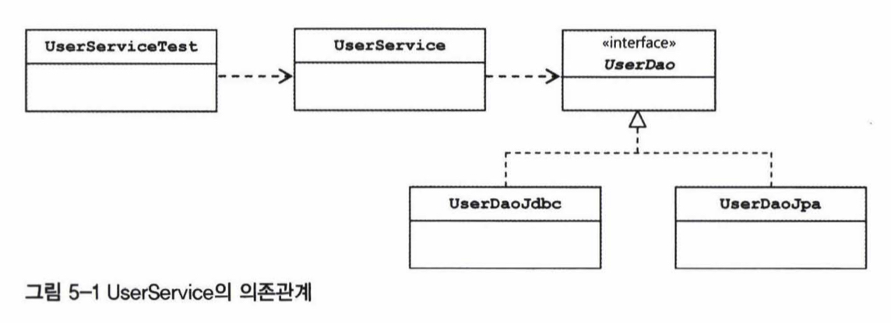

```java
@Service
public class UserService {

    private UserDao userDao;

    public UserService(UserDao userDao) {
        this.userDao = userDao;
    }
}
```

### `UserServiceTest` 테스트 클래스

```java
@SpringBootTest
public class UserServiceTest {

   @Autowired
    UserService userService;
}
```

### `upgradeLevels()` 메서드

- 이제 비즈니스 로직을 구현해보자.
    - 사실 TDD라면 우선 테스트 코드를 먼저 작성하는 편이 좋다.

```java
@Service
public class UserService {

    // ...
    
    public void upgradeLevels() {
        List<User> users = userDao.getAll();

        for (User user: users) {

            boolean changed = switch (user.getLevel()) {
                case BASIC:
                    if (user.getLogin() >= 50) {
                        user.setLevel(Level.SILVER);
                        yield true;
                    }

                    yield false;

                case SILVER:
                    if (user.getRecommend() >= 30) {
                        user.setLevel(Level.GOLD);
                        yield true;
                    }

                    yield false;

                case GOLD:
                    yield false;
            };

            if (changed) {
                userDao.update(user);
            }
        }

    }
}
```

- 개인적으로는 `switch`를 선호하는 편이다.

### `upgradeLevels()` 테스트

- 적어도 가능한 모든 조건을 하나씩은 확인해봐야 한다.

```java
@SpringBootTest
public class UserServiceTest {

    // ...
    @BeforeEach
    public void setUp() {
        // 테스트를 위한 픽스처
        // 테스트를 위한 값은 경곗값을 기준으로 잡는게 좋다.
        users = Arrays.asList(
                new User("bumjin", "박범진", "p1", Level.BASIC, 49, 0),
                new User("joytouch", "강명성", "p2", Level.BASIC, 50, 0),
                new User("erwins", "신승한", "p3", Level.SILVER, 60, 29),
                new User("madnite1", "이상호", "p4", Level.SILVER, 60, 30),
                new User("green", "오민규", "p5", Level.GOLD, 100, 100)
        );
    }

    @Test
    public void upgradeLevels() {
        userDao.deleteAll();
        for (User user: users) {
            userDao.add(user);
        }

        userService.upgradeLevels();

        checkLevel(users.get(0), Level.BASIC);
        checkLevel(users.get(1), Level.SILVER);
        checkLevel(users.get(2), Level.SILVER);
        checkLevel(users.get(3), Level.GOLD);
        checkLevel(users.get(4), Level.GOLD);
    }

    private void checkLevel(User user, Level expectedLevel) {
        User userUpdate = userDao.get(user.getId());
        Assertions.assertThat(userUpdate.getLevel()).isEqualTo(expectedLevel);
    }
}
```

## 5.1.4 `UserService.add()`

- 기존 사용자 관리 비즈니스 로직에 대해 구현은 했지만 처음 가입하는 사용자에 대해서는 구현하지 않았다.
- 이 코드는 어디에 구현하는게 좋을까?
    - 마찬가지로 `UserDao`은 안어울린다.
    - `User` 클래스에서 아예 `Level.BASIC`으로 초기화 하는 것은 나쁘지 않은 생각인 것 같지만, 최초 가입시에만 필요한 행위이므로 이를 위해 초기화 책임을 갖는 것은 좀 문제가 있어 보인다.
        - 초기화라는 행위는 비즈니스 규칙이 아니다. 이는 기술적인 규칙이다.
        - 이를 위한 초기화 행위를 구현하는 것은 안어울린다는 뜻이다.
    - 결국, 최초 가입이라는 규칙을 처리하는 곳에서 해결하면 된다.
        - 바로 `UserService`다.
- 이번엔 테스트 코드부터 작성해보자.

```java
@SpringBootTest
public class UserServiceTest {
    // ...
    
    @Test
    public void add() {
        userDao.deleteAll();

        // GOLD 레벨 유저
        User userWithlevel = users.get(4);

        // 레벨이 비어 있는 사용자
        User userWithoutLevel = users.get(0);
        userWithoutLevel.setLevel(null);

        userService.add(userWithlevel);
        userService.add(userWithoutLevel);

        // DB에 저장된 결과 가져오기
        User userWithLevelRead = userDao.get(userWithlevel.getId());
        User userWithoutLevelRead = userDao.get(userWithoutLevel.getId());

        Assertions.assertThat(userWithLevelRead.getLevel()).isEqualTo(userWithlevel.getLevel());
        Assertions.assertThat(userWithoutLevelRead.getLevel()).isEqualTo(Level.BASIC);

    }
}
```

- 이미 레벨이 있는 사용자는 레벨 업데이트를 하지 않고, 레벨이 `null`로 설정되어 있는 사용자는 `BASIC`으로 초기화되는지 확인하는 테스트를 작성했다.
- 이제 테스트가 성공하도록 구현해보자.

```java
@Service
public class UserService {
    // ...

    public void add(User user) {
        if (user.getLevel() == null) {
            user.setLevel(Level.BASIC);
        }

        userDao.add(user);
    }
}
```

- 테스트가 성공한다.
- 다만 개선할 점이 있는데, 간단한 비즈니스 로직을 담은 코드를 테스트하기 위해 DAO와 DB까지 모두 동원되는 점이 조금 불편하다.
- 이는 나중에 개선해보도록 하자.

## 5.1.5 코드 개선

### `upgradeLevels()` 메서드 코드의 문제점

- 중복이 있는가?
- 이해하기 쉬운가?
- 적절한 곳에 구현했는가?
- 변경에 쉽게 대응할 수 있는가?


```java
@Service
public class UserService {

    // ...
    
    public void upgradeLevels() {
        List<User> users = userDao.getAll();

        for (User user: users) {
            // 실제로 사용자의 레벨을 올리는 코드는 하단에 있다.
            // changed는 단지 flag의 역할을 할 뿐이다.
            // changed가 무슨 일을 하는지는 하단 코드를 봐야만 알 수 있다.
            boolean changed = switch (user.getLevel()) {

                // 새로운 Level enum이 추가될 때마다 case를 추가하고
                // 그에 맞게 비즈니스 코드를 구현해야만 한다.
                case BASIC:
                    if (user.getLogin() >= 50) {
                        user.setLevel(Level.SILVER);
                        yield true;
                    }

                    yield false;

                case SILVER:
                    if (user.getRecommend() >= 30) {
                        user.setLevel(Level.GOLD);
                        yield true;
                    }

                    yield false;

                case GOLD:
                    yield false;
            };

            if (changed) {
                userDao.update(user);
            }
        }
    }
}
```

### `upgradelevels()` 리팩토링

- 다음과 같은 코드는 보기 어떠한가?

```java
@Service
public class UserService {

    public void upgradeLevels() {
        List<User> users = userDao.getAll();

        for (User user: users) {
            if (canUpgradeLevel(user)) {
                upgradeLevel(user);
            }
        }
    }
}
```

- 가독성도 좋고, 책임도 분명하다.
- `canUpgradeLevel()`과 `upgradeLevel()`을 구현해보자.

```java
@Service
public class UserService {
    // ...
    
    private boolean canUpgradeLevel(User user) {
        Level currentLevel = user.getLevel();

        return switch (currentLevel) {
            case BASIC -> (user.getLogin() >= 50);
            case SILVER -> (user.getRecommend() >= 30);
            case GOLD -> false;

            // enhanced switch 에서는 처리할 필요가 없다.
            // 모든 enum 케이스를 처리하지 않으면 애초에 컴파일 오류가 발생하기 때문이다.
            // default -> throw new IllegalArgumentException("Unknown Level: " + currentLevel);
        };
    }
}
```

```java
@Service
public class UserService {
    // ...
    
    private void upgradeLevel(User user) {
        switch (user.getLevel()) {
            case BASIC -> user.setLevel(Level.SILVER);
            case SILVER -> user.setLevel(Level.GOLD);
        }
        
        userDao.update(user);
    }

}
```

- `upgradeLevel()`은 좀 더 개선의 여지가 있다.
- 다음 레벨이 무엇인지 `upgradeLevel()`이 알 필요는 없다.

```java
public enum Level {

    // 다음 레벨이 무엇인지는 Level이 알고 있으면 된다.
    GOLD(3, null), SILVER(2, GOLD), BASIC(1, SILVER);

    private final int value;
    private final Level next;

    Level(int value, Level next) {
        this.value = value;
        this.next = next;
    }

    public int intValue() {
        return value;
    }

    public Level nextLevel() {
        return this.next;
    }

    public static Level valueOf(int value) {
        return switch (value) {
            case 1 -> BASIC;
            case 2 -> SILVER;
            case 3 -> GOLD;
            default -> throw new AssertionError("Unknown value: " + value);
        };
    }
}
```

- 사용자의 정보를 업데이트하는 책임은 사용자가 갖는게 낫다.
    - `UserService`가 `User`가 어떤 필드를 갖고 있는지 알 필요는 없다.

```java
public class User {
    // ...
    
    public void upgradeLevel() {
        Level nextLevel = this.level.nextLevel();

        if (nextLevel == null) {
            throw new IllegalStateException(this.level + "은 업그레이드가 불가능합니다.");
        } else {
            this.level = nextLevel;
        }
    }
}
```

- 사용자의 레벨 정보를 `User`만이 변경할 수 있게 하면, 사용자의 레벨 변경과 관련된 코드는 `User`만 확인하면 된다는 뜻이다.
- 사용자의 레벨이 언제 바뀌었는지 확인하고자 한다면 `User.upgradeLevel()`에 로그를 남기도록 코드를 변경하기만 하면 된다.
- 이제 `UserService`의 코드가 더 간결해졌다.

```java
@Service
public class UserService {
    // ...
    
    private void upgradeLevel(User user) {
        user.upgradeLevel();        
        userDao.update(user);
    }
}
```

### `User` 테스트

- `upgradeLevel()`은 간단한 로직을 담고 있기 때문에 테스트할 필요가 없을 수도 있다.
- 하지만 계속 새로운 기능과 로직이 추가될 가능성이 있으므로 테스트를 만들어두면 도움이 된다.

```java
public class UserTest {
    User user;

    @BeforeEach
    public void setUp() {
        user = new User(
                "id",
                "name",
                "password",
                Level.BASIC,
                0,
                0
        );
    }

    @Test
    public void upgradeLevel() {
        Level[] levels = Level.values();
        for (Level level: levels) {
            if (level.nextLevel() == null) {
                continue;
            }

            user.setLevel(level);
            user.upgradeLevel();
            Assertions.assertThat(user.getLevel()).isEqualTo(level.nextLevel());
        }
    }

    @Test
    public void cannotUpgradeLevel() {
        Level[] levels = Level.values();
        for (Level level: levels) {
            if (level.nextLevel() != null) {
                continue;
            }

            user.setLevel(level);
            Assertions.assertThatThrownBy(() -> user.upgradeLevel())
                    .isInstanceOf(IllegalStateException.class);
        }
    }
}
```

- `User` 테스트는 스프링 컨텍스트가 따로 필요 없기 때문에 `@SpringBootTest` 어노테이션이 필요 없다.

### `UserServiceTest` 개선

- 기존 테스트에서는 `checkLevel()` 메서드를 호출할 때 일일이 다음 단계의 레벨이 무엇인지 넣어줬다.
- 이것도 사실 중복이다.
    - `Level`이 갖고 있어야 할 다음 레벨이 무엇인가 하는 정보를 테스트에 직접 넣어둘 이유가 없다.
    - 이렇게 되면 레벨의 구조가 변경될 때마다 테스트 코드도 같이 변경되어야만 한다.
    - `upgradeLevels()`는 언제 레벨이 업그레이드 되어야만 하는지만을 테스트해야 한다.

```java
@SpringBootTest
public class UserServiceTest {
    // ...
    
    @Test
    public void upgradeLevels() {
        userDao.deleteAll();
        for (User user: users) {
            userDao.add(user);
        }

        userService.upgradeLevels();

        checkLevel(users.get(0), false);
        checkLevel(users.get(1), true);
        checkLevel(users.get(2), false);
        checkLevel(users.get(3), true);
        checkLevel(users.get(4), false);
    }

    private void checkLevel(User user, boolean upgraded) {
        User userUpdate = userDao.get(user.getId());
        if (upgraded) {
            Assertions.assertThat(userUpdate.getLevel()).isEqualTo(user.getLevel().nextLevel());
        } else {
            Assertions.assertThat(userUpdate.getLevel()).isEqualTo(user.getLevel());
        }
    }

}

```

- 개선된 코드는 가독성도 향상되었는데, 테스트 메서드의 목적이 분명하게 드러난다.
    - 기존에 레벨을 받았을 때에는 무엇을 테스트하는지 메서드만으로는 불분명했다.
    - 개선된 코드에서는 업그레이드 되는지를 테스트해야 한다는 목적이 드러난다.
- 매직넘버도 리팩토링 해보자.

```java
@Service
public class UserService {

    public static final int MIN_LOGCOUNT_FOR_SILVER = 50;
    public static final int MIN_RECOMMEND_FOR_GOLD = 30;

    // ...

    private boolean canUpgradeLevel(User user) {
        Level currentLevel = user.getLevel();

        return switch (currentLevel) {
            case BASIC -> (user.getLogin() >= MIN_LOGCOUNT_FOR_SILVER);
            case SILVER -> (user.getRecommend() >= MIN_RECOMMEND_FOR_GOLD);
            case GOLD -> false;
        };
    }

    // ...
}
```

```java

import static com.example.chapter3.UserService.MIN_LOGCOUNT_FOR_SILVER;
import static com.example.chapter3.UserService.MIN_RECOMMEND_FOR_GOLD;

@SpringBootTest
public class UserServiceTest {

    @Autowired
    UserDao userDao;

    @Autowired
    UserService userService;

    private List<User> users;

    @BeforeEach
    public void setUp() {
        users = Arrays.asList(
                new User("bumjin", "박범진", "p1", Level.BASIC, MIN_LOGCOUNT_FOR_SILVER - 1, 0),
                new User("joytouch", "강명성", "p2", Level.BASIC, MIN_LOGCOUNT_FOR_SILVER, 0),
                new User("erwins", "신승한", "p3", Level.SILVER, 60, MIN_RECOMMEND_FOR_GOLD - 1),
                new User("madnite1", "이상호", "p4", Level.SILVER, 60, MIN_RECOMMEND_FOR_GOLD),
                new User("green", "오민규", "p5", Level.GOLD, 100, Integer.MAX_VALUE)
        );
    }

    // ...
}

```

- 이제 상수값이 어떤 의미를 나타내는지 코드만으로 파악이 가능해졌다.
- 더 나아가 레벨 업그레이드 정책을 유연하게 변경하고자 한다면, 업그레이드 책임을 가진 클래스를 추가하는 방안을 생각해볼 수 있다.

```java
public interface UserLevelUpgradePolicy {
    boolean canUpgradeLevel(User user);
    void upgradeLevel(User user);
}
```

# 5.2 트랜잭션 서비스 추상화

- 사용자 레벨 관리 기능에 대한 어플리케이션 레벨의 구현은 끝이 났다.
- 하지만 만약 인프라스트럭처 레벨에서 오류가 발생한다면 어떻게 될까?
    - 배치 작업으로 사용자 레벨을 업그레이드 하는 도중 네트워크가 끊기거나 서버에 장애가 발생한 경우는 어떻게 해야 할 것인가?
- 사용자 레벨의 업그레이드는 원자적 오퍼레이션이라는 결론을 얻었다고 하자.
    - 모두 업그레이드 되거나, 모두 업그레이드 안되거나

## 5.2.1 모 아니면 도

- 우리가 구현한 코드는 작업이 진행되던 도중 예외가 발생하면 어떻게 될까?

### 테스트용 `UserService` 대역

- `UserService`를 상속하는 클래스를 만들어서 예외 상황을 만들어보자.
- 테스트에서만 사용할 클래스라면 번거롭게 파일을 따로 만들지 말고 테스트 클래스 내부에 `static class`로 만드는 것도 간편하다.

```java
@SpringBootTest
public class UserServiceTest {

    static class TestUserService extends UserService {
        private String id;

        private TestUserService(UserDao userDao, String id) {
            super(userDao);
            this.id = id;
        }

        @Override
        protected void upgradeLevel(User user) {
            if (user.getId().equals(this.id)) {
                throw new TestUserServiceException();
            }

            super.upgradeLevel(user);
        }
    }

    static class TestUserServiceException extends RuntimeException {
        // empty
    }

    // ...
}
```

### 강제 예외 발생을 통한 테스트

- 테스트의 목적은 사용자 레벨 업그레이드를 시도하다가 중간에 예외가 발생했을 경우, 그 전에 업그레이드했던 사용자도 다시 원래 상태로 돌아갔는지를 확인하는 것이다.

```java
@SpringBootTest
public class UserServiceTest {

    // ...
    
    @Test
    public void upgradeAllOrNothing() {
        UserService testUserService = new TestUserService(userDao, users.get(3).getId());

        userDao.deleteAll();
        for (User user : users) {
            userDao.add(user);
        }

        Assertions.assertThatThrownBy(testUserService::upgradeLevels)
                .isInstanceOf(TestUserServiceException.class);

        checkLevel(users.get(1), false);
    }
}
```

- 테스트를 돌려보면 실패함을 알 수 있다.

### 테스트 실패의 원인

- DB와 JDBC 프로그래밍에 대한 기본적인 지식이 있다면 왜 이런 결과가 나왔는지 알 수 있다.
- 바로 트랜잭션 문제다.

### ACID Principle

- 데이터베이스의 트랜잭션 안전성과 일관성을 보장하기 위한 원칙

#### Atomic(원자성)

- 트랜잭션은 모두 실행되거나 아니면 모두 실행되지 않아야 한다.
- 실행되면 해당 사항은 영구적으로 반영되어야 하며, 중간에 실패하거나 오류 등이 발생하게 된다면, 실행되기 이전의 상태로 돌아가야 한다.

#### Consistency(일관성)

- 트랜잭션 실행 이후에도 데이터베이스는 트랜잭션 실행 이전과 마찬가지로 데이터의 일관성을 유지해야 한다.
    - 트랜잭션은 일련의 오퍼레이션의 집합이다.
    - 이런 일련의 오퍼레이션이 실행되는 동안에도 항상 스키마의 제약조건(Constraint)을 만족해야 된다는 뜻이다.
    - 즉, 트랜잭션이 성공하건 실패하건 제약조건이 일관되게 유지되어야 한다는 규칙이다.

#### Isolation(격리성)

- 여러 트랜잭션이 동시에 실행되어도, 서로 영향을 줘선 안된다.
    - 하지만 이는 매우 이상적이며, 현실적으로는 성능문제로 인해 격리수준(Isolation level)을 나눈다.

#### Durability(지속성)

- 트랜잭션이 성공한 뒤에 해당 변경사항은 영구적으로 유지되어야 한다.

### Isolation Level

#### Read Uncommitted

- 가장 낮은 격리수준
- 커밋되지 않은 A 트랜잭션에서 실행된 오퍼레이션의 결과를 B 트랜잭션에서 읽을 수 있다(Dirty Read).
- 만약 A 트랜잭션이 롤백되어 실패한 경우, B 트랜잭션은 데이터의 일관성을 잃어버릴 가능성이 있다.

#### Read Committed

- 기본 격리수준
- 각 트랜잭션은 커밋된 변경사항만 읽을 수 있다.
- 하지만 이 경우에도 한 트랜잭션 내에서 일관되지 않은 데이터를 읽을 가능성이 있다.
    - Non-repeatable read
    - 트랜잭션이 진행되는 도중 커밋되어 변경된 데이터를 읽는 경우

#### Repeatable Read

- 트랜잭션이 진행되는 동안 데이터가 변하지 않음이 보장된다.
    - Read Lock
- Non-repeatable read, Phantom read 현상을 방지한다.

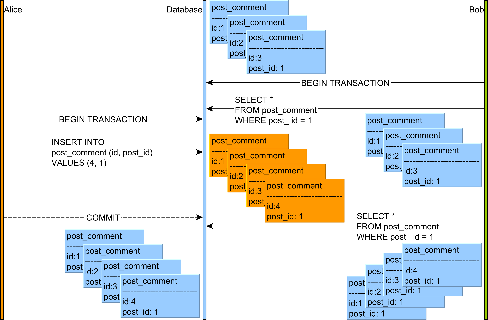

#### Serializable

- 각 트랜잭션이 순차적으로 실행되는 것처럼 보장됨
    - 세부 내용은 구현에 따라 당연히 다를 수 있음. 실제로는 동시에 실행되지만, 순차적으로 실행되는 것과 별반 다를바 없는 상태 등
- 최상위 레벨의 격리수준이며, 동시성으로 인해 발생할 수 있는 상황이 모두 차단됨
    - 하지만 그만큼 퍼포먼스가 매우 떨어짐

## 5.2.2 트랜잭션 경계설정

- 트랜잭션의 원자적 범위를 정할 수 있다.
    - 트랜잭션의 시작을 선언하고
    - 성공적으로 완료된 경우 Commit
    - 실패한 경우 다시 되돌리는 Rollback

### JDBC 트랜잭션의 트랜잭션 경계설정

- 트랜잭션의 경계는 하나의 커넥션 단위에서 이뤄진다.

```java
Connection c = dataSource.getConnection();


c.setAutoCommit(false)

// 트랜잭션 경계범위 시작

try {
    PreparedStatement st1 =
        c.prepareStatement("...");
    st1.executeUpdate();

    PreparedStatement st2 =
        c.prepareStatement("...");
    st2.executeUpdate();

    c.commit();
    // 트랜잭션 경계범위 끝
} catch (Exception e) {
    c.rollback(); // 경계범위 시작 직전 상태로 돌아감
}
```

### `UserService`와 `UserDao`의 트랜잭션 문제

- 이유는 간단하다. 트랜잭션의 경계설정을 하지 않고 `autoCommit()` 상태로 작업을 했기 때문이다.
- 하지만 `JdbcTemplate`을 사용하기 시작하면서 트랜잭션의 경계설정을 하기 위한 `Connection` 오브젝트를 구경하지 못했다.
- `JdbcTemplate`은 하나의 메서드마다 각 트랜잭션 범위를 갖는다.
- 따라서 `update()`를 여러번 호출하면 호출마다 트랜잭션 범위를 가지므로 하나로 묶지를 못하는 것이다.

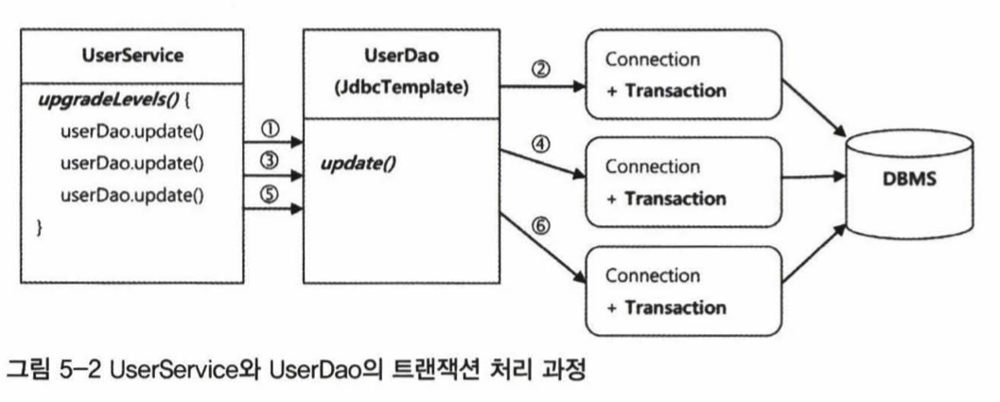

### 비즈니스 로직 내의 트랜잭션 경계설정

- 이 문제를 해결하려면 `UserDao`에 비즈니스 로직을 끌고 오거나, 비즈니스 로직 안에 DB 코드를 끌고 와야한다.

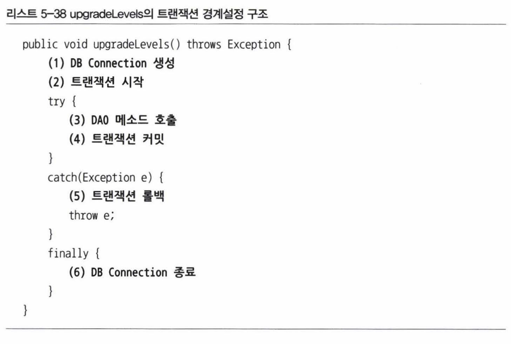

- 또한 같은 커넥션을 유지해야 하므로, `UserDao`의 모든 메서드는 `Connection`을 DI받아야만 한다.

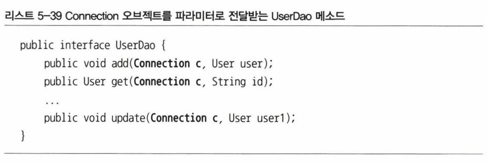

- 또한 `upgradeLevels()`에서 `Connection`을 `upgradeLevel()`까지 전달해줘야 한다.

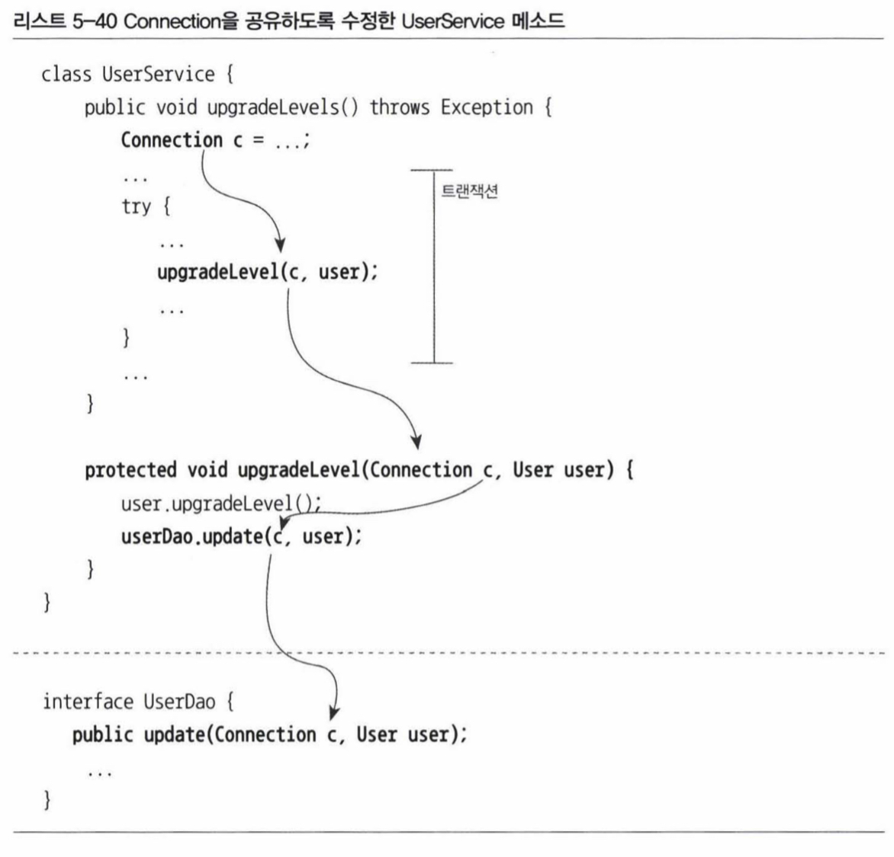

### `UserService` 트랜잭션 경계설정의 문제점

- 트랜잭션을 달성하기 위해 변경된 코드는 우리가 노력해서 분리해놓은 관심사를 무효화 시켰다.
    - 비즈니스 코드에 인프라 코드가 들어갔다.
- `Connection` 오브젝트는 `JdbcTemplate`을 호출하는 곳까지 전달해야만 한다.
    - 리액트의 prop drilling 같은 현상
    - `UserService`의 프로퍼티로 갖게 된다면, `UserSerivce`는 더 이상 싱글톤 빈으로 존재할 수 없다.
        - 동시성 문제가 발생한다.
        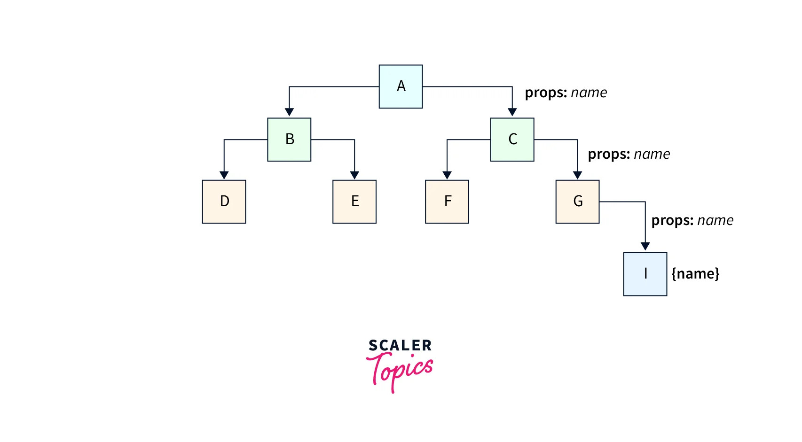
- `UserService`에 인프라 레벨 코드가 들어가면서, 기존에 작성해뒀던 `UserService` 코드가 깨진다.

## 5.2.3 트랜잭션 동기화

- 클린코드를 유지하면서 트랜잭션의 목적까지 달성해보도록 하자.

### `Connection` 파라미터 제거

- 트랜잭션을 사용하려면 동일한 `Connection`을 사용해야 한다는 점은 변함이 없다.
- 따라서, 어디선가 `Connection`을 받아올 수 있기만 하면 된다.
- 스프링은 이를 `TransactionSynchronizations`로 해결한다.

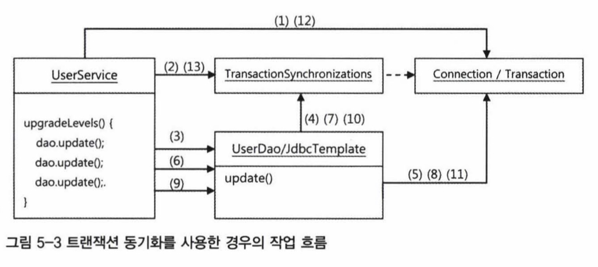

1. `UserService`는 `Connection`을 생성한다.
2. 생성한 `Connection`을 `TransactionSynchronizations`에 저장한다.
3. `UserDao`를 호출한다.
4. `UserDao`는 `Connection`을 `TransactionSynchronizations`에서 가져온다.
5. `Connection`을 이용해 작업을 수행한다.
6. 3 ~ 5 반복한다.
12. `UserService`는 `Connection`의 `commit()`을 호출한다.
13. `TransactionSynchronizations`에 저장된 `Connection`을 제거한다.

### 트랜잭션 동기화 적용

- 동시성 환경에서도 안전하게 트랜잭션 동기화 방법을 구현하는 일이 기술적으로 간단하지는 않다.
- 하지만 스프링을 이용하면 쉽게 구현할 수 있다.

```java
@Service
public class UserService {

    // ...

    // DataSource를 DI 받도록 한다.
    private DataSource dataSource;

    public UserService(UserDao userDao, DataSource dataSource) {
        this.userDao = userDao;
        this.dataSource = dataSource;
    }

    public void upgradeLevels() throws Exception  {
        // 동기화 작업을 초기화한다.
        TransactionSynchronizationManager.initSynchronization();

        // DB 커넥션을 생성하고 트래잭션을 시작한다.
        // 이후의 DAO 작업은 모두 여기서 시작한 트랜잭션 안에서 진행된다.
        Connection c = DataSourceUtils.getConnection(dataSource);
        c.setAutoCommit(false);

        try {

            List<User> users = userDao.getAll();

            for (User user: users) {
                if (canUpgradeLevel(user)) {
                    upgradeLevel(user);
                }
            }

            c.commit();

        } catch (Exception e) {
            c.rollback();
            throw e;

        } finally {
            // 리소스를 정리한다.
            DataSourceUtils.releaseConnection(c, dataSource);
            TransactionSynchronizationManager.unbindResource(this.dataSource);
            TransactionSynchronizationManager.clearSynchronization();
        }
    }

}
```

- `TransactionSynchronizationManager`를 이용해 동기화를 시작하면, `JdbcTemplate`은 동기화된 DB `Connection`을 사용하게 된다.
- 따라서 `Connection` 오브젝트를 이곳저곳 넘기지 않아도 같은 트랜잭션 내에서 처리되게 할 수 있다.

### 트랜잭션 테스트 보완

- `UserService`가 `DataSource`를 DI 받도록 변경됐으니, 이에 맞게 테스트 코드도 수정해야만 한다.

```java
@SpringBootTest
public class UserServiceTest {

    static class TestUserService extends UserService {
        private String id;

        // DataSource를 추가한다.
        private TestUserService(UserDao userDao, DataSource dataSource String id) {
            super(userDao, dataSource);
            this.id = id;
        }

    // ...
}
```

### `JdbcTemplate`과 트랜잭션 동기화

- `JdbcTemplate`은 영리하게 동작하도록 설계되어 있다.
- 트랜잭션 동기화 저장소에 등록된 DB `Connection`이나 트랜잭션이 없는 경우에는 `JdbcTemplate`이 직접 DB 커넥션을 만들고 트랜잭션을 시작해서 `JDBC` 작업을 진행한다.
- 만약 이미 진행중인 트랜잭션이 있다면, 해당 트랜잭션에 참여한다.
    - 즉, 해당 `Connection`을 사용한다.

## 5.2.4 트랜잭션 서비스 추상화

- 지금까지의 코드는 책임과 성격에 따라 도메인 레이어와 인프라스트럭처 레이어를 잘 분리하고 유지할 수 있게 만든 코드다.
- JDBC를 사용하면서 이보다 더 깔끔한 코드를 만들기는 힘들 것이다.

### 기술과 환경에 종속되는 트랜잭션 경계설정 코드

- 그러나 현재의 코드는 로컬 트랜잭션에 종속되어 있으며, 이는 결국 단 하나의 DB로만 트랜잭션 경계를 설정할 수 있다는 뜻이다.
- 만약 여러 개의 DB를 사용해야 한다면 현재의 코드로는 불가능하다.
- 이를 달성하기 위해서는 글로벌 트랜잭션 방식을 사용해야 한다.
- 자바는 이를 지원하기 위해 `JTA(Java Transaction API)`를 제공하고 있다.

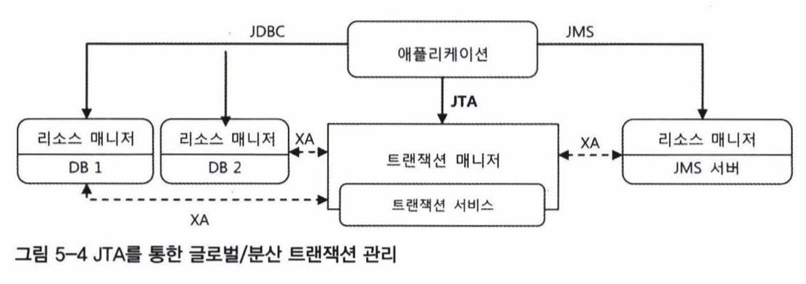

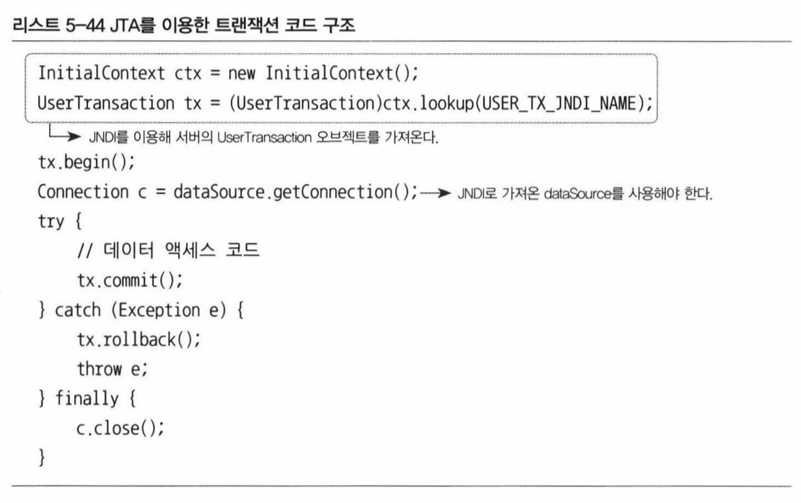

### 트랜잭션 API의 의존관계 문제와 해결책

- `UserService`에 트랜잭션 경계설정 코드를 도입한 후에 클래스의 의존관게는 아래와 같이 돼버렸다.

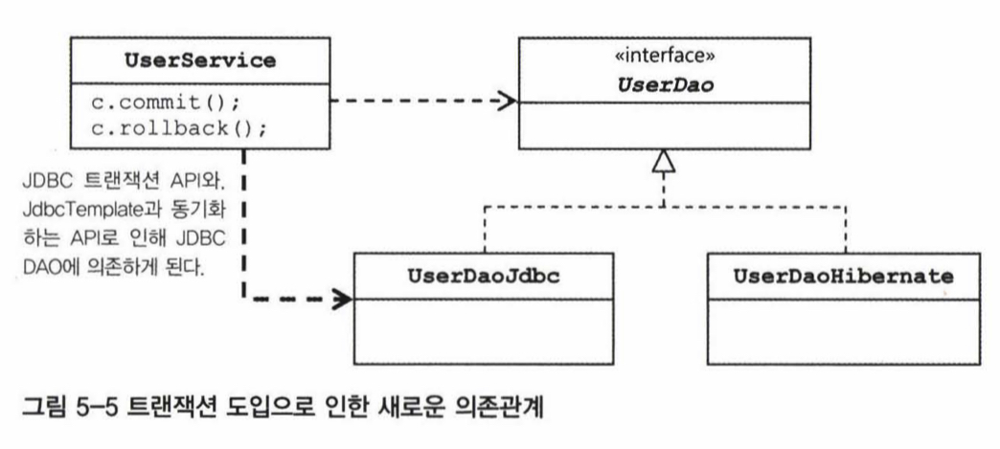

- 우리는 데이터 엑세스 기술을 추상화 하기 위해 `UserDao`를 사용했으나, 트랜잭션 경계설정 코드로 인해 무용지물이 돼버렸다.
- 현재의 트랜잭션 경계설정 코드는 `JDBC`에 의존적이다. 즉, 데이터 엑세스 기술에 의존적이다.
- 트랜잭션 경계설정 코드를 데이터 엑세스 기술에 의존하지 않게 할 수 있을까?
- 지금껏 했던 것처럼 이 역시 추상화하면 된다.
- 트랜잭션 경계설정은 일반적인 패턴을 갖고 있기 때문에, 이를 추상화할 수 있다.

### 스프링의 트랜잭션 서비스 추상화

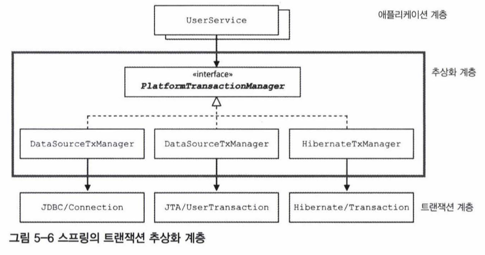

```java
    public void upgradeLevels() {
        PlatformTransactionManager transactionManager =
                new DataSourceTransactionManager(dataSource);

        TransactionStatus status =
                transactionManager.getTransaction(new DefaultTransactionDefinition());

        try {
            List<User> users = userDao.getAll();
            for (User user: users) {
                if (canUpgradeLevel(user)) {
                    upgradeLevel(user);
                }
            }

            transactionManager.commit(status);
        } catch (Exception e) {
            transactionManager.rollback(status);
            throw e;
        }
    }
```

- `Connection`은 `TransactionManager`가 컨트롤한다.

### 트랜잭션 기술 설정의 분리

- `UserService`이 구현기술에 종속되는 부분은 `new DataSourceTransactionManager(dataSource)` 부분이다.
- 만약 다른 기술이 필요하다면 `PlatformTransactionManager` 타입의 다른 구현체로 변경하기만 하면 된다.
- 이를 스프링빈으로 DI받도록 수정하기만 하면 된다.

```java
@Service
public class UserService {

    private UserDao userDao;
    private PlatformTransactionManager transactionManager;

    public UserService(UserDao userDao, PlatformTransactionManager transactionManager) {
        this.userDao = userDao;
        this.transactionManager = transactionManager;
    }
    // ...
}
```

# 5.3 서비스 추상화와 단일 책임 원칙

### 수직, 수평 계층구조와 의존관계

- 기술과 서비스에 대한 추상화 기법을 이용하면 특정 기술환경에 종속되지 않는 코드를 만들 수 있다.
- 트랜잭션 추상화는 애플리케이션의 비즈니스 로직과 그 하위에서 동작하는 로우레벨의 트랜잭션 기술이라는 아예 다른 계층의 특성을 갖는 코드를 분리한 것이다.

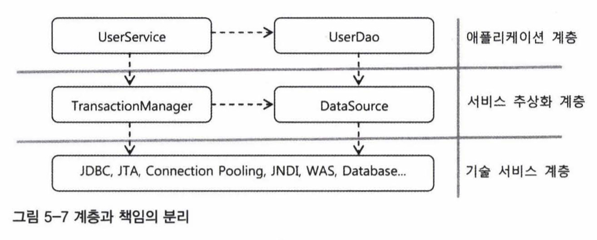

- 각자 인터페이스로 의존하고 있기 때문에, 구현 기술에 상관없어졌다. 이는 결합도가 낮아졌다는 뜻이다.
- 이는 각 오브젝트가 독자적으로 변경(확장)될 수 있다는 뜻이다.

### SRP(Single Responsibility Principle)

- 단 하나의 책임을 가져야 한다.
- 즉, 해당 책임이 변경되는 경우에만 코드가 변경되어야만 한다.
- `UserService`에 JDBC `Connection`의 메서드를 직접 사용하는 트랜잭션 코드가 있었을 때를 생각해보자.
    - 사용자 레벨을 어떻게 관리할 것인지에 대한 책임
    - 트랜잭션을 어떻게 관리할 것인지에 대한 책임
- 이는 각 책임에 변경사항이 생기면, 코드도 같이 변경된다는 뜻이다.
- 하지만 현재와 같이 책임을 분리해놓으면, 트랜잭션 종속기술이 변경되던 안되던 `UserService`의 코드는 변경되지 않는다.

```java
@Service
public class UserService {
    // ...
    
    public void upgradeLevels() {

        // 이 부분은 트랜잭션의 구현 기술이 어떻게 변경되든
        // UserService에서는 변경되지 않는 부분이다.
        PlatformTransactionManager transactionManager =
                new DataSourceTransactionManager(dataSource);

        TransactionStatus status =
                transactionManager.getTransaction(new DefaultTransactionDefinition());

        // UserService의 비즈니스 규칙이 변경되면
        // 아래의 부분만 변경될 것이다.
        try {
            List<User> users = userDao.getAll();
            for (User user: users) {
                if (canUpgradeLevel(user)) {
                    upgradeLevel(user);
                }
            }

            transactionManager.commit(status);
        } catch (Exception e) {
            transactionManager.rollback(status);
            throw e;
        }
    }
}
```

### 단일 책임 원칙의 장점

- 변경이 필요할 때 수정 대상이 명확해진다.
- 어플리케이션이 방대해지면, 수많은 코드조각에서 어떤 부분을 변경해야 되는지 파악하기가 쉽지 않다.
    - 변경될 부분을 빠르게 파악가능하고, 변경이 쉬운 것이 바로 좋은 코드인 것이다.
- 즉, 좋은 설계와 코드를 만드는 모든 과정은 쉬운 유지보수성을 위한 길인 것이다.
- 스프링은 이 목적을 달성하기 쉽게 도와준다.

# 5.4 메일 서비스 추상화

- 사용자 레벨이 업그레이드 될 때 사용자에게 안내 메일을 발송하게 해보자.

## 5.4.1 `JavaMail`을 이용한 메일 발송 기능

- 자바에서 메일을 발송할 때에는 표준 기술인 `JavaMail`을 사용하면 된다.

```java
@Service
public class UserService {
    // ...

    protected void upgradeLevel(User user) {
        user.upgradeLevel();
        userDao.update(user);

        // 메일전송 메서드 추가
        sendUpgradeEmail(user);
    }

    private void sendUpgradeEmail(User user) {
        Properties props = new Properties();
        props.put("mail.smtp.host", "mail.ksug.org");
        Session s = Session.getInstance(props, null);

        MimeMessage message = new MimeMessage(s);
        try {
            message.setFrom(new InternetAddress("useradmin@ksug.org"));
            message.addRecipient(Message.RecipientType.TO,
                    new InternetAddress(user.getEmail()));

            message.setSubject("Upgrade 안내");
            message.setText("사용자님의 등급이 " + user.getLevel().name() + "로 업그레이드되었습니다.");

            Transport.send(message);

        } catch (AddressException e) {
            throw new RuntimeException(e);
        } catch (MessagingException e) {
            throw new RuntimeException(e);
        }

    }

    // ...
}
```

## 5.4.2 `JavaMail`이 포함된 코드의 테스트

- 이런 코드는 테스트할 수가 없다.
    - 운영용 메일 SMTP 정보가 코드에 종속되어 있다.
- 테스트할 때 실제 메일이 발송되는 것은 바람직하지 않다.
- 또한, 엄밀히 말해서 메일 발송 테스트라는 것은 불가능하다.
    - 우리가 할 수 있는 최선은 메일 발송용 서버에 문제 없이 전달됐는지 확인하는 것 뿐이다.
    - 실제로 발송됐는지는 모른다.
        - 발송을 했는지는 `SMTP` 서버가 안다.
- 사실 메일 서버는 충분히 테스트된 시스템일 것이므로, `SMTP`로 메일 전송 요청을 받으면 별문제 없이 메일이 잘 전송됐다고 믿어도 충분하다.
- 따라서 `JavaMail`을 통해 메일 서버까지만 메일이 잘 전달됐으면, 결국 사용자에게도 메일이 잘 보내졌을 것이라고 생각할 수 있다.

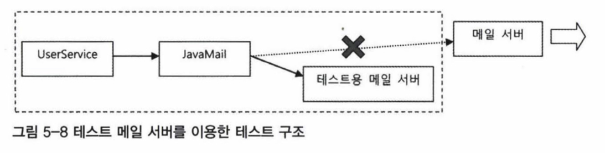

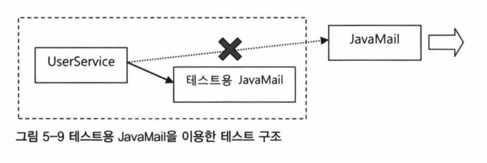

## 5.4.3 테스트를 위한 서비스 추상화

- 테스트용 `JavaMail`을 사용하게 만든다면 문제가 해결된다.
- 이는 테스트코드에서 DB를 연결할 때 테스트용 `DataSource`를 사용하는 것과 같다.

### `JavaMail`을 이용한 테스트의 문제점

- 하지만 `JavaMail`의 API만으로는 이 문제를 해결할 수 없다.
- 메일 발송을 위해 가장 먼저 생성해야 하는 `Session` 클래스는 인터페이스가 아닌 클래스다.
- 또한 생성자가 `private`이라 직접 생성도 불가능하다.
- 더 나아가 상속이 불가능한 `final` 클래스다.
- 즉, 도무지 구현을 바꿔치기 할 방법이 없다.
    - 우리는 지금 테스트용 `JavaMail` 인스턴스를 만드는 것이 목적인데, 만들 수 없다는 것이 문제다.
- 메일 메시지를 작성하는 `MailMessage`, 전송 기능을 맡고 있는 `Transport`도 마찬가지다.

### 메일 발송 기능 추상화

- 스프링은 이에 대한 해결책을 제공해준다.

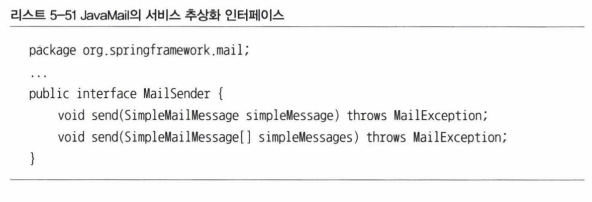

- 이 인터페이스는 `SimpleMailMessage`라는 인터페이스를 구현한 클래스에 담긴 메일 메시지를 전송하는 메서드로만 구성되어 있다.
- 기본적으로는 `JavaMail`을 사용해 메일 발송 기능을 제공하는 `JavaMailSenderImpl` 클래스를 이용하면 된다.

```java
// ...
    private void sendUpgradeEmail(User user) {
        JavaMailSenderImpl mailSender = new JavaMailSenderImpl();

        mailSender.setHost("mail.server.com");

        SimpleMailMessage mailMessage = new SimpleMailMessage();
        mailMessage.setTo(user.getEmail());
        mailMessage.setFrom("useradmin@ksug.org");
        mailMessage.setSubject("Upgrade 안내");
        mailMessage.setText("사용자님의 등급이 " + user.getLevel().name() + "로 업그레이드 되었습니다.");

        mailSender.send(mailMessage);
    }
    // ...
```

- 지저분한 `try/catch` 블럭이 사라졌다.
- 여전히 `JavaMailSenderImpl`이라는 구현체에 의존하고 있다.
- 이를 DI 받도록 변경하면 해결된다.

```java
@Service
public class UserService {
    // ...
    private UserDao userDao;
    private PlatformTransactionManager transactionManager;
    private MailSender mailSender;

    public UserService(UserDao userDao, PlatformTransactionManager transactionManager, MailSender mailSender) {
        this.userDao = userDao;
        this.transactionManager = transactionManager;
        this.mailSender = mailSender;
    }

    // ...
}
```

### 테스트용 메일 발송 오브젝트

- 이제 모든 준비가 끝났다. 테스트용 메일 전송 클래스를 만들어보자.

```java
public class DummyMailSender implements MailSender {
    @Override
    public void send(SimpleMailMessage simpleMessage) throws MailException {
        // ...
    }

    @Override
    public void send(SimpleMailMessage... simpleMessages) throws MailException {
        // ...
    }
}
```

- 테스트용 프로파일에 빈으로 등록하면 끝난다.

### 테스트와 서비스 추상화

- 일반적으로 서비스 추상화라고 하면 트랜잭션과 같이 기능은 유사하나 사용 방법이 다른 로우레벨의 다양한 기술에 대해 추상 인터페이스와 일관성 있는 접근 방법을 제공해주는 것을 말한다.
- 반면에 `JavaMail`의 경우처럼 테스트를 어렵게 만드는 건전하지 않은 방식으로 설계된 API를 사용할 때도 유용하게 쓰일 수 있다.
    - 써드파티에 대한 의존성을 느슨하게 만들어줄 수 있다.
- 테스트 가능하게 코드를 변경하였더니, 코드가 유연해졌다.
    - 테스트 코드를 작성하는 행위 자체가 환경과 기반기술의 변경을 강제하기 때문이다.
    - 이 목적을 달성하도록 코드를 작성했더니 결국 좋은 설계가 되는 효과를 얻게 됐다.

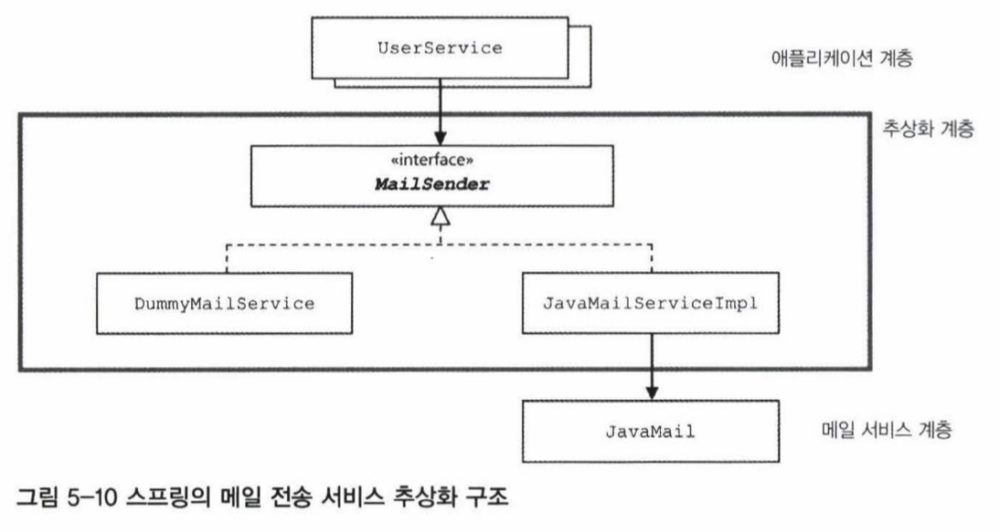

- 이제 `MailSender`만 구현한다면, 기반기술이 변경되어도 `UserService` 의 코드는 변경될 일이 없다.

## 5.4.4 테스트 대역

- `DummyMailSender`는 현재 아무것도 하는 일이 없다.
    - 구현 부분이 비어있다.
- 하는 일이 없어도 가치는 크다.
    - 구현이 없으므로 테스트 속도가 매우 빠르다.
    - 따라서 테스트를 자주 실행할 수 있다.

### 의존 오브젝트의 변경을 통한 테스트 방법

- `UserDaoTest`로 테스트가 진행될 때의 상황을 살펴보자.
- `UserDao`의 운영환경의 인프라는 복잡하지만, 테스트는 간단하게 구현되어 있다.
- 이는 운영환경의 인프라가 테스트에서는 굳이 필요하지 않기 때문이다.

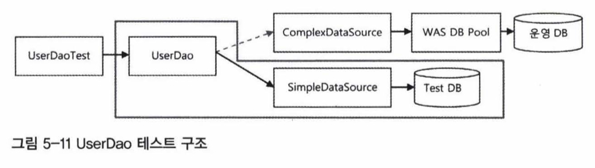

- `UserService` 테스트 구조를 살펴보자.
- 테스트에 알맞게 메일 발송용 코드를 테스트시에만 추가했다 지웠다 할 수는 없기 때문에 추상화를 통해 `DummyMailSender`를 이용하여 코드를 작성했고, 이는 테스트 할 때에나 실제 운영할 때에나 일관된 코드를 사용할 수 있었다.

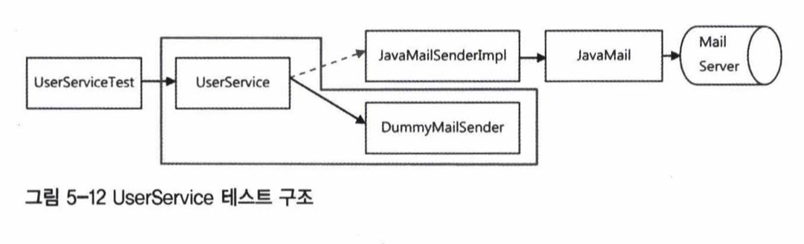

- 객체지향 프로그래밍에서 객체는 다른 객체와의 협력을 통해 작업을 수행하기 때문에, 테스트에 실제 운영에 사용되는 오브젝트를 쓸 수 없는 문제점이 생긴다.
- 이를 우리는 인터페이스를 통해 결합도를 낮추고, DI로 쉽게 해결할 수 있었다.

### 테스트 대역의 종류와 특징

- 이렇게 테스트용으로 사용되는 특별한 오브젝트들을 통틀어서 **테스트 대역(Test double)**이라고 부른다.

#### Fake

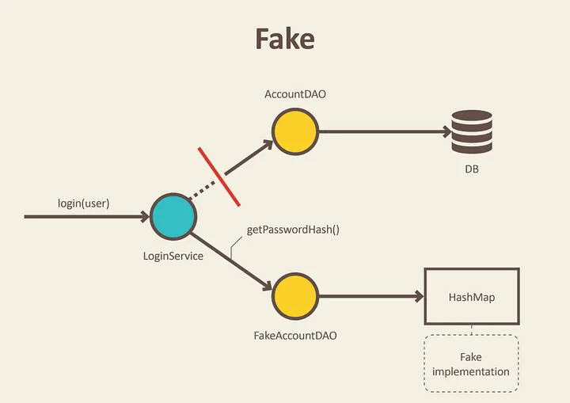

- 실제 객체가 하는 일을 테스트용으로 유사하게 구현한 객체
- 구글에서는 가능한한 실제 구현체를 이용해 테스트하는 것을 권장하며, 외부 의존성이 있는 객체의 경우 Fake 객체를 구현해서 하는 것을 권장한다.
    - Fake 객체는 실제 구현체와 같은 디렉터리에 위치시킨다.
    - Fake 객체의 유지보수 책임은 해당 실제 구현체를 구현한(수정한) 사람이 책임진다.
- Fake 객체는 어찌됐든 실제 객체와 유사하게 구현된 객체이므로, 일단 사용하면 테스트가 쉽게 깨지지 않는다.
    - 또한 거짓 성공이 발생할 확률이 매우 적은데, 어쨌든 Fake는 실제 구현체와 비슷한 로직으로 코드로써 구현됐기 때문이다.

#### Stub

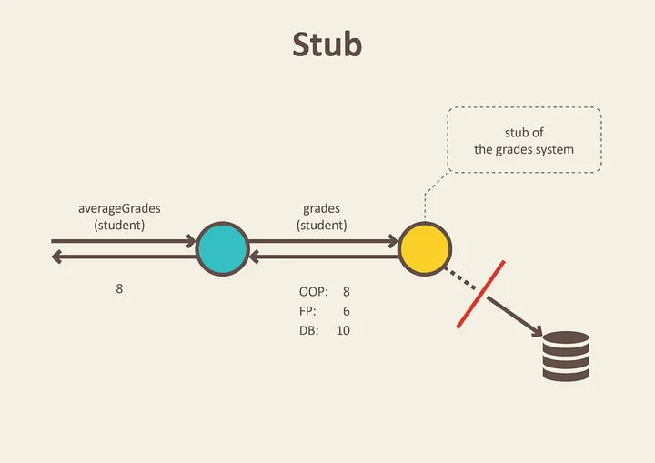

- Fake와 비슷한데, 보통은 써드파티 라이브러리 등에 의해 구현된다.
- 메서드 호출에 대한 응답값을 미리 정의해 둬서 사용한다.
    - 이는 거짓 성공이 발생할 확률이 높은데, Stub의 결과는 결국 우리가 성공으로 기대하는 값으로 설정하기 때문이다.

#### Mock

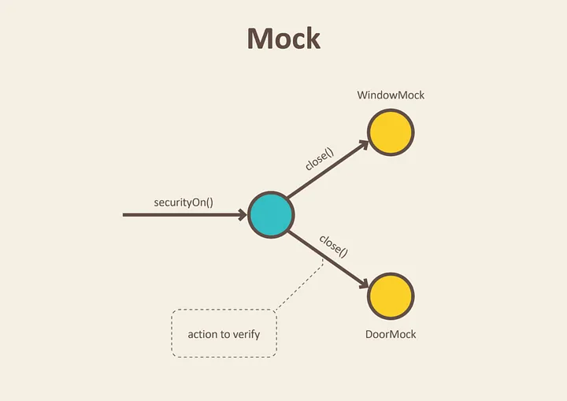

- Stub과 비슷하게 써드파티 라이브러리 등에 의해 구현된다.
- Mock은 Stub에서 더 나아가 테스트 대상이 되는 객체의 행동까지 테스트할 수 있게 한다.
    - 이는 결국 화이트박스 테스트가 된다는 뜻이고, 깨지기 쉬운 테스트가 되기 십상이다.
        - 테스트 대상 오브젝트나 이 오브젝트가 의존하고 있는 오브젝트의 구현이 변경되면 테스트가 바로 깨져버린다.
        - 즉, 변경에 너무 취약하다.
            - 메서드 이름의 변경, 매개변수의 변경, 리턴 값, 호출 순서 등 그냥 코드레벨에 의존성이 생겨버린다.
        - 구글에서는 제한적으로 사용하며, 어떤 개발자들은 Mock은 절대로 사용해서는 안된다고 주장하기까지 한다고 한다.
    - 개인적인 경험으로도 Mock을 남용하는 것은 결국 깨지기 쉬운 테스트가 되어 테스트 코드를 작성하지 않게 됐었다.
    - Fake를 사용했을 때 변경이 발생하면 애초에 컴파일 레벨에서 터져버려서 변경된 부분을 파악하기가 매우 간편하다.
        - 또한 구글의 원칙에 따라 Fake 객체의 유지보수 책임은 구현객체를 구현한(수정한)사람에게 있으므로, 어떤 부분을 변경해야 할지 쉽게 파악할 수 있어서 변경에 큰 어려움도 없다.
- Mock은 아주 제한적으로 사용 하는 것이 좋다.

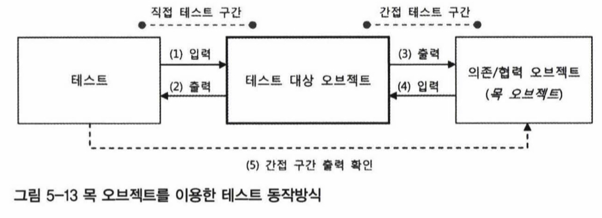

